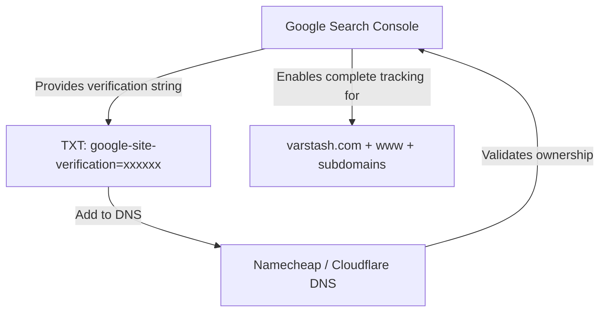

# Complete SaaS Guide: Google Search Console (GSC)

This guide provides an end-to-end operational manual for setting up, verifying, optimizing, and monitoring **VarStash** (`varstash.com`) on **Google Search Console (GSC)** to maximize organic search indexing, keyword impressions, and click-through rates (CTR).

---

## 1. What is Google Search Console & Why is it Critical?

While tools like PostHog and Plausible track what users do **after** they land on your website, Google Search Console is the **only authoritative tool** that reveals:
- Exactly which search terms Google users typed before finding your app.
- How many times your site appeared in search results (**Impressions**).
- What percentage of users clicked through (**Click-Through Rate / CTR**).
- Your exact average ranking position for every query (**Average Position**).
- Any crawling, rendering, or mobile usability errors detected by Googlebot.

---

## 2. Step-by-Step Setup & DNS Domain Verification

There are two property types in Google Search Console:
1. **URL Prefix Property** (e.g. `https://varstash.com/`): Only tracks that exact protocol/subdomain.
2. **Domain Property** (e.g. `varstash.com`): **(Recommended)** Automatically tracks `http`, `https`, `www`, non-`www`, and all subdomains (`clerk.varstash.com`, `api.varstash.com`).



### Verification Procedure:
1. Go to [search.google.com/search-console](https://search.google.com/search-console).
2. Sign in with your Google account.
3. In the property selection dropdown, choose **Add Property**.
4. In the **Domain** card (left option), enter: `varstash.com` (do not enter `https://` or `www`).
5. Click **Continue**. Google will generate a unique TXT verification record:
   ```text
   google-site-verification=AbCdEfGhIjKlMnOpQrStUvWxYz1234567890
   ```
6. Copy this string.

#### Adding the Record in Your DNS Provider:
- **If using Cloudflare:**
  - Go to Cloudflare Dashboard > **DNS** > **Records** > **Add Record**.
  - Type: `TXT`
  - Name: `@` (or `varstash.com`)
  - Content: Paste the `google-site-verification=...` string.
  - TTL: Auto. Save.
- **If using Namecheap BasicDNS:**
  - Go to Namecheap > **Domain List** > `varstash.com` > **Advanced DNS**.
  - Under **Host Records**, click **Add New Record**.
  - Type: `TXT Record`
  - Host: `@`
  - Value: Paste the verification code.
  - TTL: Automatic. Save changes.
7. Return to Google Search Console and click **Verify**. (Verification with Cloudflare is instant; with Namecheap, give it 5–15 minutes).

---

## 3. Submitting the XML Sitemap & Validating `robots.txt`

Once ownership is verified, submit your sitemap so Googlebot can discover all pages immediately.

### 3.1 Sitemap Submission
1. In the GSC sidebar, click **Sitemaps** (under Indexing).
2. Under "Add a new sitemap", enter:
   ```text
   sitemap.xml
   ```
3. Click **Submit**.
4. The status will initially read `Pending`, then transition to `Success` with the number of discovered URLs listed.

### 3.2 Validating `robots.txt`
1. In the sidebar, navigate to **Settings > robots.txt**.
2. Confirm Googlebot successfully fetched `https://varstash.com/robots.txt`.
3. Ensure there are no directives blocking Googlebot from crawling public assets (such as CSS or JS bundles in `/assets/` needed for client-side rendering).

---

## 4. URL Inspection & Testing Client-Side React SPA Hydration

Because VarStash is built with modern React / Vite, you must verify that Googlebot's headless browser correctly renders your client-side JavaScript.

1. In the top search bar of GSC, paste your live URL: `https://varstash.com/` and press Enter.
2. Click **Test Live URL** (top right).
3. Once the live test finishes (takes ~30 seconds):
   - Click **View Tested Page**.
   - Select the **Screenshot** tab: Confirm that the visual canvas, typography, buttons, and marketing copy render cleanly without a white blank screen.
   - Select the **HTML** tab: Confirm your `<h1>`, `<h2>`, and description copy are present in the DOM.
4. Click **Request Indexing**. This places your URL in a priority queue for Googlebot to index within 24–48 hours.

---

## 5. Rich Results & Schema.org Validation

Google Search Console monitors structured data on your site and awards special display enhancements in search results.

1. Under the **Enhancements** or **Experience** section in the GSC sidebar, look for:
   - **Software Application**: Validates your pricing and app category.
   - **FAQ**: Validates expandable FAQ accordions that can appear directly inside Google's search result cards.
2. You can also validate your live structured data using Google's official [Rich Results Test](https://search.google.com/test/rich-results) by pasting `https://varstash.com`.

---

## 6. Performance Reports & The "Striking Distance" SEO Strategy

After 7–14 days of being indexed, your **Performance** tab will populate with query data.

```
Total Clicks   Total Impressions   Average CTR   Average Position
    142             3,480             4.1%            14.2
```

### The "Striking Distance" Optimization Playbook:
The highest-ROI SEO strategy for a young SaaS is optimizing queries that rank on **Page 2 (Positions 8 to 20)**:

1. In GSC, click **Performance > Search results**.
2. Check all four metrics: **Clicks**, **Impressions**, **CTR**, and **Position**.
3. Scroll down to the **Queries** table.
4. Filter for queries where **Position is greater than 7 and less than 21**.
5. Sort by **Impressions** (descending).
6. These queries represent keywords where Google already considers your site relevant, but users aren't clicking because you are on the bottom of page 1 or top of page 2.

#### Example Actions:
- If `local first secret manager` shows 800 impressions at Position 12:
  - Add a dedicated subsection or heading on your landing page: *"Why a Local-First Secret Manager Matters"*.
  - Include the exact phrase in your `<title>` or meta description.
  - This typically elevates the keyword into Positions 1–4, resulting in a 5x–10x increase in clicks.

---

## 7. Index Coverage Errors & Troubleshooting

Check the **Pages** report under Indexing weekly to address any indexing blocks:

| Status / Message | What It Means | How to Fix It |
| :--- | :--- | :--- |
| **Discovered – currently not indexed** | Google knows the URL exists, but has not crawled it yet due to low site authority. | Normal for brand-new domains. Gain high-quality backlinks (Product Hunt, GitHub, Twitter) and request indexing via URL Inspection. |
| **Crawled – currently not indexed** | Google crawled the page, but decided it doesn't offer enough unique value or content to index. | Ensure landing page has substantial content (FAQ, comparison tables, documentation) rather than a bare login form. |
| **Page with redirect** | Google found an alternate URL (e.g., `http://` or non-`www`) that redirects. | Normal if your canonical points to `https://varstash.com`. Ensure sitemap only lists the final destination URL. |
| **Alternate page with proper canonical tag** | Duplicate versions (like tracking query parameters `?ref=producthunt`) correctly mapped to root. | No action needed; working as intended. |

---

## 8. Ongoing 15-Minute Weekly Maintenance Checklist

- [ ] **Review Performance Trend**: Check if total impressions and average position are trending upward week-over-week.
- [ ] **Check Security & Manual Actions**: Under "Security & Manual Actions", verify both show a green checkmark: *"No issues detected"*.
- [ ] **Inspect Core Web Vitals**: Ensure LCP (Largest Contentful Paint) is < 2.5s and CLS (Cumulative Layout Shift) is < 0.1.
- [ ] **Harvest New Search Queries**: Find high-intent long-tail keywords typed by real users and incorporate them into your product documentation and landing page copy.
