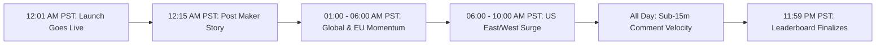

# Complete SaaS Launch Playbook: Product Hunt

This document provides a battle-tested, step-by-step masterclass on launching **VarStash** (`varstash.com`) on **Product Hunt** to maximize reach, earn badges (Top 5 / Product of the Day), and convert launch traffic into active users and paying Pro subscribers.

---

## 1. Product Hunt Fundamentals & Strategic Timing

Product Hunt (PH) operates on a 24-hour daily leaderboard cycle governed by **Pacific Standard Time (PST)**. Every day at **12:01 AM PST**, the leaderboard resets.



### Best Day of the Week to Launch

| Days | Competition Level | Traffic Volume | Best Strategic Objective |
| :--- | :--- | :--- | :--- |
| **Tuesday – Thursday** | 🔥 Extremely High (funded startups, established SaaS) | Maximum (100k+ daily visitors) | Maximize raw traffic, backlink weight, and investor visibility. Harder to get #1. |
| **Sunday – Monday** | 🟢 Moderate to Low | Solid (30k–50k visitors) | **Best for Solo Founders & Indie SaaS.** High probability of ranking **#1 to #3 Product of the Day**. |
| **Friday – Saturday** | 🔵 Low | Lower (weekend drop) | Good for small weekend hackathons or casual tools. |

> **Recommendation for VarStash:** **Sunday midnight PST (into Monday morning)** or **Monday midnight PST (into Tuesday morning)**. This strikes the sweet spot: high indie developer engagement with less risk of getting crowded out by well-funded VC launches.

---

## 2. Maker vs. Hunter: The Modern Reality

In previous years, getting an elite "Hunter" (like Chris Messina or Kevin William David) to post your product notified thousands of followers.

**Today, that algorithm has changed:**
- Product Hunt removed automatic push notifications to hunter followers.
- **Self-Hunting ("Hunter is Maker") is now standard and preferred.**
- Community members and the Product Hunt staff favor genuine founders launching their own work. Launching as the **Maker** gives you the "Maker" badge and puts your personal voice at the forefront.

---

## 3. Launch Asset Preparation Checklist

Prepare every single asset at least **7 days prior** to launch. Do not improvise on launch day.

### 3.1 Product Details & Copy
- **Product Name:** `VarStash` (or `VarStash (KeyStash)`)
- **Tagline (Strict limit: 60 characters):**
  - *Draft 1:* `Visual, local-first API key manager with live LLM spend tracking` (64 chars — too long)
  - *Winning Tagline:* `Visual secret & API key manager with live LLM spend tracking` (60 chars)
  - *Alternative:* `Excalidraw, but for managing secrets & API spend` (49 chars)
- **Topics / Categories (Select 3–5):**
  - `Developer Tools`
  - `Productivity`
  - `Artificial Intelligence`
  - `Open Source`
  - `SaaS`
- **Pricing Status:** `Free options available` (Free Tier + $5/mo Pro)
- **Direct App Link:** `https://varstash.com`

---

### 3.2 Media & Gallery Assets

Product Hunt allows an animated thumbnail, gallery images, and a YouTube demo.

1. **Thumbnail / Logo (Required: 240x240 px, recommended: 500x500 px):**
   - Use an animated **GIF** (under 3MB) with a clean 2–3 second loop.
   - Example animation: The VarStash logo glowing, or a vault opening with a secret key icon.
   - *Static fallback:* High-contrast SVG/PNG logo on a dark background.

2. **Gallery Screenshots (5 to 7 slides, Recommended Resolution: 1270 x 760 px):**
   - **Slide 1 (Hero Hook):** The Visual Canvas with profiles (Dev, Staging, Prod) and drag-and-drop cards. Headline: *"Excalidraw, but for secrets."*
   - **Slide 2 (The Real Pain):** Split screen comparison: messy Apple Notes / Slack plain text vs. VarStash client-side encrypted vault.
   - **Slide 3 (Live API Spend Monitoring):** Real-time spend progress bars for OpenAI, Anthropic, and OpenRouter with threshold limit alerts.
   - **Slide 4 (Zero-Cloud Data Sovereignty):** Infographic illustrating Web Crypto AES-GCM 256-bit encryption running locally in IndexedDB.
   - **Slide 5 (1-Click Handoff):** Encrypted payload generation with ephemeral magic-link delivery for teams.
   - **Slide 6 (Pricing / Indie Philosophy):** Clean pricing breakdown ($0 unlimited local vs. $5 Pro).

3. **Demo Video (YouTube or Loom, 45–90 seconds max):**
   - 0:00–0:15: The pain of losing API keys or runaway $1,000 OpenAI bills while vibe coding in Cursor.
   - 0:15–0:45: Live screen capture: Dragging keys on the canvas, showing instant .env export, and live spend polling.
   - 0:45–1:00: Explaining local encryption and the launch offer.

---

### 3.3 The Maker's First Comment (The Golden Story Hook)

As soon as the post goes live at 12:01 AM PST, you **must immediately** submit the first comment. This pins your personal narrative to the top of the discussion.

#### Maker Comment Template:

```markdown
Hey Product Hunt! 👋 I’m Aadil, the maker of VarStash.

Like many of you building fast with Cursor, v0, and Claude 3.5 Sonnet, I found myself juggling dozens of OpenAI, Anthropic, and database keys. My system? Honestly… Apple Notes and unencrypted text files. 

Worse, I lived in constant anxiety of a runaway while-loop racking up a surprise $1,500 API bill overnight.

Existing solutions like Doppler or HashiCorp Vault are built for enterprise DevOps teams. They require terminal CLIs, complex IAM permissions, and expensive per-seat subscriptions.

I wanted something different:
⚡ As visual and fast as Excalidraw
🔒 100% local-first and client-side encrypted (Web Crypto AES-GCM) — our servers NEVER see your plaintext keys
📊 Live API spend monitoring — visual progress bars for OpenAI, Claude, and OpenRouter so you catch runaway bills before they hit your credit card
🚀 Zero cloud setup required to get started

VarStash is free forever for unlimited local secrets, visual profiles, and manual .env exports.

For the PH community:
We've set up an exclusive 20% lifetime discount on our Pro tier (which includes automated magic-link handoffs and spend limit alerts). Just use code **PHLAUNCH** at checkout!

I’d love your brutal, honest feedback:
1. What API providers should we add spend polling for next?
2. What’s your current (and probably messy) secret management routine?

I’ll be hanging out here all day to answer every question! 🚀
```

---

## 4. Pre-Launch Warmup (T-30 Days to T-1 Day)

Product Hunt’s modern anti-spam algorithm detects **"ghost voters"**—accounts created on launch day with zero prior activity. If your supporters create accounts on launch day and immediately upvote you, their upvotes are algorithmically downgraded or discarded.

### Pre-Launch Checklist:
1. **Create a "Coming Soon" Teaser Page (T-14 Days):**
   - Go to [producthunt.com/ship](https://www.producthunt.com/ship) or create a scheduled upcoming launch page.
   - Collect email subscriptions from friends, colleagues, and early users so Product Hunt sends them an automated email on launch morning.
2. **Build Maker Karma:**
   - Spend 15 minutes each week upvoting, testing, and leaving thoughtful feedback on other makers' launches.
   - Participate in Product Hunt Discussions.
3. **Assemble Your "Launch Squad" (T-7 Days):**
   - Create a spreadsheet or DM list of 50–100 friends, indie hackers, and beta testers across Twitter/X, Discord, and Slack.
   - Send a personal message 3 days before:
     > *"Hey! I'm launching VarStash on Product Hunt this coming Monday at 12:01 AM PST. It’s a visual, local-first API key manager with live spend tracking. Would you be open to taking a look and sharing your thoughts on launch day?"*

---

## 5. Launch Day Execution: Hour-by-Hour Timeline

| Time (PST) | Phase | Action Items |
| :--- | :--- | :--- |
| **12:01 AM** | **Lift-Off** | The product post goes live. Verify all links, images, and video work properly. |
| **12:05 AM** | **First Comment** | Post your pre-written Maker Story comment immediately. |
| **12:15 AM** | **Wave 1 (Personal Core)** | Notify your closest 10–20 colleagues and founders across global timezones (Europe/Asia) to get the initial momentum started. |
| **03:00 AM – 06:00 AM** | **European Wave** | Engage with European makers and early US risers. Respond to every comment within 10 minutes. |
| **06:00 AM** | **US East Coast Wakes Up** | Post launch announcement on X / Twitter (#BuildInPublic, #VibeCoding, #IndieHacker). Share a 30-second screen demo video. |
| **07:30 AM** | **Developer Communities** | Post a value-first story on Reddit (`r/SideProject`, `r/Cursor`), Indie Hackers, and Discord channels. |
| **09:00 AM** | **US West Coast Wakes Up** | Reach out to West Coast founders and send a reminder email to your teaser subscriber list. |
| **12:00 PM – 06:00 PM** | **The Midday Grind** | Monitor leaderboard rank. Keep response time under 15 minutes. Upvote velocity + comment activity keeps you in the top 5 featured section. |
| **08:00 PM – 11:59 PM** | **The Final Sprint** | Push final call-to-action on Twitter and LinkedIn. Leaderboard finalizes at 11:59:59 PM PST. |

---

## 6. The Product Hunt Algorithm & Anti-Spam Guardrails

> [!CAUTION]
> **Product Hunt Strict Penalties:**
> - **NEVER** ask for "upvotes". Use phrasing like: *"We'd love your feedback and support on Product Hunt today!"*
> - **NEVER** use Fiverr, upvote bots, or exchange rings. PH algorithms flag coordinated voting patterns and will shadowban or unfeature your product instantly.
> - **Direct Link vs. Search:** Do not link directly to a raw upvote button. Encourage users to visit the product page, explore the screenshots, and leave an authentic review.
> - **Weighting:** Comments and discussion threads have higher algorithmic weight than bare upvotes.

---

## 7. Post-Launch: Badges & Conversion

Once the day concludes:
1. **Embed the Official Product Hunt Badge:**
   Add the badge to your landing page hero or footer to establish social proof:
   ```html
   <a href="https://www.producthunt.com/posts/varstash?utm_source=badge-featured" target="_blank">
     
   </a>
   ```
2. **Post a Retrospective:** Write a "What I Learned Launching on Product Hunt" thread on X and Indie Hackers detailing your stats (visitors, signups, Pro revenue converted).
