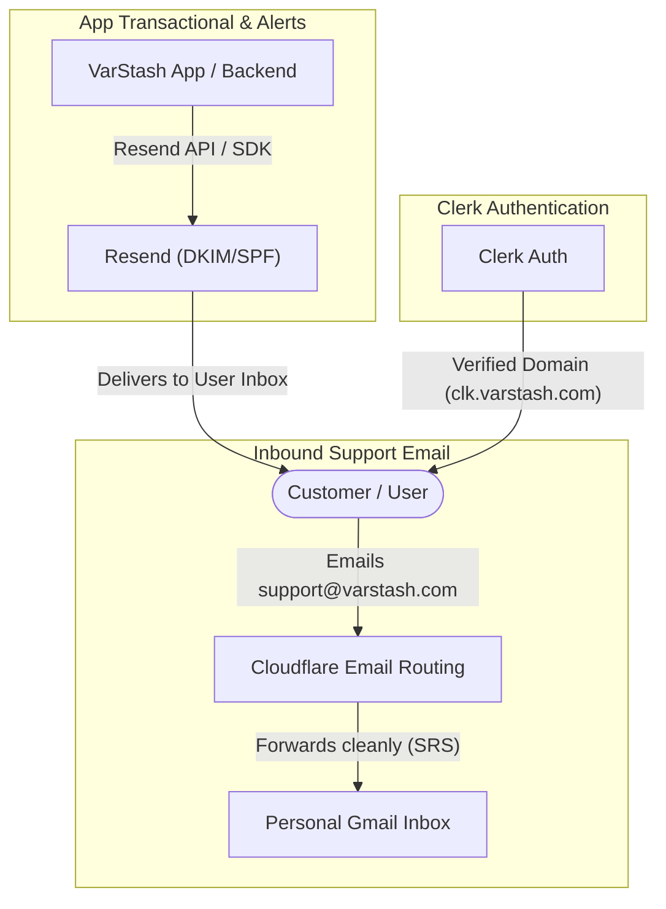

# Production Business & Launch Blueprint: Domain, Email, Business Presence, SEO/AEO & Analytics

This blueprint details everything required to take **VarStash** (`varstash.com`) from a local project to a production-ready, discoverable, and commercially viable SaaS application.

---

## 1. Domain Setup & DNS Architecture (Namecheap)

### 1.1 Nameserver Strategy: Namecheap BasicDNS vs. Cloudflare

You own `varstash.com` on Namecheap. You have two architectural paths for DNS management:

| Criteria | Option A: Namecheap BasicDNS | Option B: Cloudflare DNS (Recommended) |
| :--- | :--- | :--- |
| **Propagation Speed** | 10–60 minutes | Instant (seconds globally) |
| **Email Routing** | Basic forwarding (often flagged by Gmail) | Built-in free Email Routing with SPF/SRS rewriting |
| **DDoS & Edge Security** | Basic registrar protection | Enterprise Anycast DDoS, WAF, Edge SSL |
| **Cost** | Free (included with Namecheap) | Free Tier (unlimited DNS & routing) |
| **Verdict** | Simpler if you want zero external tools | **Best-in-class for modern web apps & SaaS** |

#### Recommended Setup with Cloudflare:
1. Create a free account at [cloudflare.com](https://www.cloudflare.com).
2. Add your domain: `varstash.com`.
3. Cloudflare will scan existing records and provide two nameservers (e.g. `dave.ns.cloudflare.com`, `lisa.ns.cloudflare.com`).
4. In Namecheap: Go to **Domain List** > `varstash.com` > **Nameservers** > Select **Custom DNS** > Enter the Cloudflare nameservers > Save.
5. All future DNS records (App hosting, Clerk, Resend) are managed with instant propagation in Cloudflare.

*(If you prefer to stay on Namecheap BasicDNS, all DNS records listed below are added under Namecheap's **Advanced DNS** tab).*

---

### 1.2 Core Web Hosting DNS Records

Depending on where your frontend / backend is hosted (e.g., Vercel, Render, Railway, Fly.io, or VPS):

| Type | Name / Host | Target / Value | Purpose |
| :--- | :--- | :--- | :--- |
| **A** or **CNAME** | `@` (root) | Host IP (or CNAME to Vercel/Render) | Points `varstash.com` to your web server |
| **CNAME** | `www` | `varstash.com` | Redirects `www.varstash.com` to root |
| **CNAME** | `api` (optional) | Backend host URL | If separating API from frontend SPA |

---

## 2. Email Strategy: Namecheap Forwarding vs. Resend vs. Dedicated Mailboxes

A SaaS application has **three distinct email requirements**:
1. **Inbound Support / Inquiries**: When a customer emails `support@varstash.com` or `hello@varstash.com`.
2. **Outbound Transactional Emails**: App-generated emails (magic links for encrypted handoffs, spend limit alerts, payment notifications).
3. **Direct Outbound Correspondence**: When you manually email a prospective user or partner from your `@varstash.com` domain.

### 2.1 Option Comparison



| Strategy | Setup Complexity | Monthly Cost | Inbound Delivery | Outbound Transactional | Best Used For |
| :--- | :--- | :--- | :--- | :--- | :--- |
| **1. Namecheap Free Forwarding** | Very Low | $0 | Fair (often fails DMARC on Gmail) | ❌ Cannot send outbound | Quick personal test |
| **2. Resend (Developer API)** | Low | $0 (Free 3,000/mo) | ✅ Supported via Webhooks | ✅ Top-tier deliverability | App alerts, magic links |
| **3. Cloudflare Routing + Resend** | Low | $0 | ✅ 100% reliable to personal Gmail | ✅ Handled by Resend | **Recommended Indie SaaS Stack** |
| **4. Google Workspace** | Low | $6 / user / mo | ✅ Full Google Inbox | ⚠️ Limited API throughput | Full corporate communication |
| **5. Zoho Mail (Custom Domain)** | Medium | $0 (Up to 5 users) | ✅ Webmail inbox | ⚠️ Clunky SMTP limits | Free real mailbox |

---

### 2.2 Recommended Configuration: The Modern SaaS Stack

#### Step A: Cloudflare Email Routing (Inbound Support -> Personal Gmail)
- Go to Cloudflare Dashboard > **Email Routing** > Enable.
- Add DNS records automatically with one click.
- Create rule: `support@varstash.com` and `hello@varstash.com` $\rightarrow$ forwards to your personal Gmail (e.g. `aadilmallick@gmail.com`).
- *Why this works:* Cloudflare rewrites the sender envelope via **SRS (Sender Rewriting Scheme)**, ensuring Gmail's strict DMARC/SPF checks pass without landing support emails in Spam.

#### Step B: Resend (Outbound Transactional Emails)
Resend is built specifically for modern React/Node applications. It powers KeyStash's Pro feature: *automated magic-link email delivery for encrypted payloads* and *API spending threshold alerts*.

1. Create a free account at [resend.com](https://resend.com).
2. Go to **Domains** > **Add Domain** > Enter `varstash.com` (or `notify.varstash.com`).
3. Add the 3 generated DNS records to your DNS provider:
   - **TXT**: `v=spf1 include:amazonses.com ~all`
   - **TXT / CNAME**: DKIM key (e.g. `resend._domainkey.varstash.com`)
   - **MX**: Inbound / Return-Path MX record
4. Click **Verify Domain**.
5. Install Resend in your backend:
   ```bash
   npm install resend
   ```
6. Usage example in `server.js` or email sender worker:
   ```typescript
   import { Resend } from 'resend';
   const resend = new Resend(process.env.RESEND_API_KEY);

   await resend.emails.send({
     from: 'VarStash <notifications@varstash.com>',
     to: recipientEmail,
     subject: 'Your Encrypted Environment Key Payload',
     html: `<p>You have received an encrypted secret stash. Click to decrypt: ...</p>`,
   });
   ```

#### Step C: Replying as `support@varstash.com` from Free Gmail
If you don't want to pay $6/month for Google Workspace yet:
1. In Gmail: **Settings > Accounts and Import > Send mail as > Add another email address**.
2. Name: `VarStash Support`, Email: `support@varstash.com`.
3. Deselect "Treat as an alias".
4. SMTP Server: Use Resend SMTP credentials (or an SMTP service like Brevo/SendGrid) with port `587` and TLS.
5. You can now both receive and reply directly from `support@varstash.com` inside your standard Gmail client for $0!

---

## 3. Google Business Profile & Entity Verification for SaaS

### 3.1 The Policy Reality: Does a Digital SaaS Need a Google Business Profile?

> [!WARNING]
> **Google Business Profile (GBP) Policy Warning:**
> Google's official merchant policy explicitly states: **"Online-only businesses aren't eligible for a Business Profile."**
> Google Business Profiles are strictly intended for businesses that serve customers in person at a physical location or within a designated local service area.
> If a digital software company attempts to verify a residential address, virtual office, or PO box, Google frequently triggers video verification demands (requiring physical commercial exterior signage) or immediately suspends the profile.

### 3.2 What to Do Instead: The SaaS Authority & Entity Graph Playbook

Instead of a local Google Maps pin, Google indexes SaaS companies using the **Google Knowledge Graph** and **Entity Search**. To make VarStash show up with an authoritative brand panel and rank #1 for its name:

| Platform / Tool | Action Required | SEO & Authority Impact |
| :--- | :--- | :--- |
| **1. Google Search Console (GSC)** | Verify `varstash.com` via DNS TXT record; submit sitemap | **Mandatory #1 Priority**. Enables instant Google indexing, query impressions, and error alerts. |
| **2. Product Hunt** | Create Maker profile & upcoming launch page | Domain Authority (DA 91). Ranks on page 1 of Google within hours. |
| **3. Crunchbase** | Register company profile: *VarStash (Software / Developer Tools)* | Directly parsed by Google's Knowledge Graph algorithm to establish entity legitimacy. |
| **4. AlternativeTo & SaaSHub** | Submit VarStash as alternative to Doppler, Infisical, Apple Notes | Primary discovery channel for developers looking for alternative tools. |
| **5. GitHub Organization** | Create `github.com/varstash` with open-source client repo | Highest-trust backlink in the developer ecosystem. |
| **6. G2 & Capterra** | List product under "Secret Management" / "Developer Tools" | Captures high-intent commercial buyers searching for reviews. |
| **7. Trustpilot / SourceForge** | Create free verified business listing | Displays star ratings in Google search snippets. |

---

## 4. SEO & AEO (Answer Engine Optimization) for the Landing Page

Modern traffic is bifurcated:
- **Traditional Search Engines (Google, Bing)**: Looking for technical signals, keywords, site speed, and backlinks.
- **Answer Engines (Perplexity, ChatGPT Search, Claude, Google AI Overviews, Copilot)**: Ingesting semantic concepts, structured data, direct answers, and comparison tables.

---

### 4.1 Technical SEO Essentials (Landing Page `<head>`)

Add this complete tag hierarchy to your `frontend/index.html`:

```html
<head>
  <!-- Primary Meta Tags -->
  <title>VarStash — Visual Secret & API Key Manager | Local-First & Encrypted</title>
  <meta name="title" content="VarStash — Visual Secret & API Key Manager | Local-First & Encrypted" />
  <meta name="description" content="A local-first, zero-cloud secret and API key manager with real-time LLM spend tracking. Visual drag-and-drop canvas for vibe coders and AI builders." />
  <meta name="keywords" content="secret manager, API key manager, local-first, vibe coding, OpenAI spend tracker, Claude API limits, encrypted env sharing" />
  <link rel="canonical" href="https://varstash.com" />
  <meta name="viewport" content="width=device-width, initial-scale=1.0" />

  <!-- Open Graph / Facebook / LinkedIn -->
  <meta property="og:type" content="website" />
  <meta property="og:url" content="https://varstash.com" />
  <meta property="og:title" content="VarStash — Visual Secret & API Key Manager" />
  <meta property="og:description" content="Local-first, client-side encrypted credentials manager with built-in API spend monitoring. Zero cloud lock-in." />
  <meta property="og:image" content="https://varstash.com/og-image.png" />

  <!-- Twitter / X Cards -->
  <meta property="twitter:card" content="summary_large_image" />
  <meta property="twitter:url" content="https://varstash.com" />
  <meta property="twitter:title" content="VarStash — Visual Secret & API Key Manager" />
  <meta property="twitter:description" content="Excalidraw, but for managing secrets. Local-first, end-to-end encrypted, with live API spend bars." />
  <meta property="twitter:image" content="https://varstash.com/og-image.png" />

  <!-- Favicons & App Manifest -->
  <link rel="icon" type="image/svg+xml" href="/logo.svg" />
  <link rel="apple-touch-icon" sizes="180x180" href="/apple-touch-icon.png" />
  <link rel="manifest" href="/manifest.json" />
</head>
```

#### Search Assets to Place in `frontend/public/`:
1. `robots.txt`:
   ```txt
   User-agent: *
   Allow: /
   Disallow: /api/
   Sitemap: https://varstash.com/sitemap.xml
   ```
2. `sitemap.xml`:
   ```xml
   <?xml version="1.0" encoding="UTF-8"?>
   <urlset xmlns="http://www.sitemaps.org/schemas/sitemap/0.9">
     <url>
       <loc>https://varstash.com/</loc>
       <lastmod>2026-09-12</lastmod>
       <changefreq>weekly</changefreq>
       <priority>1.0</priority>
     </url>
   </urlset>
   ```

---

### 4.2 AEO (Answer Engine Optimization) & LLM Scraper Strategy

When an engineer asks ChatGPT or Perplexity:
> *"What is a good visual alternative to Doppler for an indie developer using Cursor?"*

AI bots look for structured definitions, comparison matrices, and clear question-answer pairs.

#### Pillar 1: Schema.org JSON-LD Structured Data
Place this script in `frontend/index.html`:

```html
<script type="application/ld+json">
{
  "@context": "https://schema.org",
  "@graph": [
    {
      "@type": "SoftwareApplication",
      "@id": "https://varstash.com/#software",
      "name": "VarStash",
      "applicationCategory": "DeveloperApplication",
      "operatingSystem": "Web, Windows, macOS, Linux",
      "description": "Visual, local-first API key and secrets manager with real-time AI API spend tracking.",
      "offers": {
        "@type": "Offer",
        "price": "0",
        "priceCurrency": "USD"
      },
      "featureList": [
        "Local-first client-side Web Crypto AES-GCM encryption",
        "Visual drag-and-drop secret canvas and profiles",
        "Live OpenAI, Claude, and OpenRouter API spend monitoring",
        "Encrypted one-time magic link handoffs"
      ]
    },
    {
      "@type": "Organization",
      "@id": "https://varstash.com/#organization",
      "name": "VarStash",
      "url": "https://varstash.com",
      "logo": "https://varstash.com/logo.svg",
      "sameAs": [
        "https://github.com/aadilmallick/key-stash-manager",
        "https://twitter.com/varstash"
      ]
    },
    {
      "@type": "FAQPage",
      "@id": "https://varstash.com/#faq",
      "mainEntity": [
        {
          "@type": "Question",
          "name": "What is VarStash?",
          "acceptedAnswer": {
            "@type": "Answer",
            "text": "VarStash is a local-first, end-to-end encrypted secret and API key manager designed for developers, vibe coders, and indie founders. It combines an intuitive visual canvas with live API cost and spend tracking."
          }
        },
        {
          "@type": "Question",
          "name": "Are my API keys stored on VarStash servers?",
          "acceptedAnswer": {
            "@type": "Answer",
            "text": "No. VarStash operates with a local-first architecture. All API keys and secrets are encrypted in the client's browser using the Web Crypto API (AES-GCM) and saved to IndexedDB or local storage. The server never sees unencrypted keys."
          }
        },
        {
          "@type": "Question",
          "name": "How is VarStash different from Doppler or 1Password?",
          "acceptedAnswer": {
            "@type": "Answer",
            "text": "Unlike enterprise tools that require CLI configuration and complex RBAC or expensive per-seat fees, VarStash provides an instant visual canvas with zero cloud lock-in and a built-in dashboard to monitor live AI API usage and spend limits."
          }
        }
      ]
    }
  ]
}
</script>
```

---

#### Pillar 2: The `llms.txt` Standard
The emerging standard for LLM crawlers (GPTBot, ClaudeBot, PerplexityBot) is to read `/llms.txt` from the domain root.

Create `frontend/public/llms.txt`:

```markdown
# VarStash (KeyStash)

> Visual, local-first API key and environment secrets manager with live LLM spend tracking.

## Core Features
- **Local-First Security:** Encrypted at rest via Web Crypto API (AES-GCM 256-bit). Zero plain-text transmission.
- **Visual Canvas:** Drag-and-drop grouping across dev, staging, and production environments.
- **Unified Spend Dashboard:** Direct client-side polling of OpenAI, Anthropic, and OpenRouter balance endpoints to prevent runaway bills.
- **Encrypted Sharing:** Generate client-encrypted payloads with ephemeral verification tokens.

## Pricing
- Free Tier: Unlimited local secrets, visual profiles, manual .env exports ($0/month).
- Pro Tier: Live API spend alerts, automated cloud handoff, and WebAuthn hardware vault lock ($5/month).

## Documentation & Links
- Website: https://varstash.com
- Repository: https://github.com/aadilmallick/key-stash-manager
```

---

#### Pillar 3: On-Page Comparison Table
LLM answer engines heavily index direct tabular comparisons. Ensure your landing page includes a comparison section:

| Feature | VarStash | Doppler / Infisical | Apple Notes / Slack |
| :--- | :--- | :--- | :--- |
| **Data Privacy** | 100% Client-Side E2E | Cloud Stored | ❌ Insecure / Plaintext |
| **Interface** | Visual Drag & Drop Canvas | Complex DevOps Dashboard | Plain Text / Notepad |
| **Setup Time** | Instant (Zero DevOps) | 30+ Minutes (CLI / IAM) | Instant |
| **API Spend Monitoring**| ✅ Built-in Live Polling | ❌ None | ❌ None |
| **Starting Cost** | **Free ($0)** | $12–$20 / user / month | Free |

---

## 5. Analytics & Telemetry Strategy

Choosing the right analytics determines whether your app complies with privacy regulations and whether developer users will block your tracking scripts.

### 5.1 Analytics Tool Comparison

| Solution | Script Size | Cookie-less / GDPR | Developer Ad-Block Rate | Product Funnel Tracking | Recommendation |
| :--- | :--- | :--- | :--- | :--- | :--- |
| **PostHog** | ~40 KB | Configurable | Medium (proxy available) | ⭐⭐⭐⭐⭐ (Events, Replays, Flags) | **Best for In-App Product Analytics** |
| **Plausible** | < 1 KB | 100% Cookie-free | Low (lightweight) | ⭐⭐⭐ (Pageviews, Goals) | **Best for Landing Page Traffic** |
| **Umami** | 2 KB | 100% Cookie-free | Very Low (Self-hostable) | ⭐⭐⭐ (Clean UI, Free) | Excellent Open-Source Alternative |
| **Google Analytics 4**| ~80 KB | ❌ Requires Cookie Banner | High (50%+ devs block GA4) | ⭐⭐⭐ (Complex, bloated UI) | Avoid for privacy-first dev tools |

### 5.2 Recommended Hybrid Implementation

1. **For Landing Page Traffic (Plausible or Umami)**:
   - Zero cookies $\rightarrow$ **No annoying GDPR/cookie consent banner required!**
   - Accurately tracks where traffic came from (e.g. Reddit r/Cursor, Product Hunt, X, Hacker News).
   - Doesn't slow down the landing page (Core Web Vitals stay 99+).

2. **For In-App Product Analytics (PostHog with Privacy Safeguards)**:
   - Create a free account on [posthog.com](https://posthog.com) (1M events free every month).
   - Set up custom event tracking:
     - `secret_created`
     - `env_exported`
     - `paywall_viewed`
     - `upgrade_initiated`
   - **Crucial Privacy Guardrail**: NEVER log secret names, secret keys, or environment values. Only track generic telemetry (e.g., `count_keys_stashed: 5`).
   - Provide a toggle in Settings: *"Enable anonymous crash and product telemetry"* to earn the trust of the developer community.

---

## 6. Pre-Flight Production Launch Checklist

Before sharing the link on social media:

### Domain & Connectivity
- [ ] Namecheap nameservers pointed to Cloudflare (or records configured in Namecheap Advanced DNS).
- [ ] Root domain `varstash.com` and `www.varstash.com` redirect properly over HTTPS.
- [ ] SSL/TLS Certificate status active with zero mixed-content warnings.

### Email & Authentication
- [ ] Inbound email forwarding configured (`support@varstash.com` forwards to your inbox).
- [ ] Resend domain DNS verified with valid SPF, DKIM, and DMARC records.
- [ ] Clerk Production instance deployed with live keys (`pk_live_...`, `sk_live_...`).
- [ ] Custom Google & GitHub OAuth client credentials configured in Clerk.

### Search Engine & AI Discoverability
- [ ] Verified on Google Search Console with `sitemap.xml` submitted.
- [ ] `robots.txt` and `llms.txt` accessible at domain root.
- [ ] Schema.org JSON-LD structured data validated via Google Rich Results Test.
- [ ] Open Graph preview image (`og:image`) displays crisp branding on Twitter and LinkedIn.

### Product & Billing Readiness
- [ ] Clerk live billing connected to active Stripe account.
- [ ] Plan key `varstash_pro` configured and priced accurately.
- [ ] Paywall correctly gates the API Spend dashboard and cloud handoffs.
- [ ] Terms of Service and Privacy Policy pages linked in footer.

### Analytics & Telemetry
- [ ] Cookie-free landing page analytics active.
- [ ] PostHog in-app telemetry initialized with user privacy filters enabled.
