# Complete Developer’s Guide to SEO and AEO for Web Applications

This guide is an actionable, code-centric reference for developers building modern web applications (SPAs, SSR, or static sites). It covers modern **Search Engine Optimization (SEO)** and **Answer Engine Optimization (AEO)**—the science of getting your software discovered, indexed, and cited by AI engines like Perplexity, ChatGPT Search, Claude, and Google AI Overviews.

---

## 1. The Developer's Mental Model: SEO vs. AEO

Traditional SEO focuses on **ranking URLs for search queries** based on keywords, backlink authority, and page speed.

Modern AEO focuses on **becoming the cited authoritative source** when an LLM synthesizes an answer for a user.

```mermaid
flowchart TD
    subgraph TraditionalSEO ["Traditional Search Engine Optimization (Google / Bing)"]
        UserQ1["User Query: 'best api key manager'"] --> Crawler["Googlebot Crawls HTML & JS"]
        Crawler --> KeywordIndex["Matches Keywords, Backlinks & PageSpeed"]
        KeywordIndex --> SERP["10 Blue Links on Page 1"]
    end

    subgraph ModernAEO ["Answer Engine Optimization (Perplexity, ChatGPT, Claude)"]
        UserQ2["User Prompt: 'How does VarStash compare to Doppler for Cursor?'"] --> LLMBot["AI Scraper: GPTBot / PerplexityBot"]
        LLMBot --> StructuredIngest["Parses JSON-LD, llms.txt & Direct Answer Blocks"]
        StructuredIngest --> Synthesis["AI Synthesizes Summary + Citation Footnote"]
    end
```



### The 7-Layer Modern Discovery Stack

1. **Layer 1: Rendering & Bot Delivery** — Ensuring both headless bots and full browsers can read your DOM.
2. **Layer 2: Metadata & Link Graph** — Canonical links, Open Graph, Twitter cards, and semantic URLs.
3. **Layer 3: Machine-Readable Schemas** — JSON-LD structured data (`SoftwareApplication`, `Organization`, `FAQPage`).
4. **Layer 4: The `llms.txt` Standard** — Dedicated context files for AI engines.
5. **Layer 5: Answer-First Content Architecture** — Direct-response headings, snippet hooks, and comparison tables.
6. **Layer 6: Image & Asset Engineering** — Next-gen formats (AVIF/WebP), responsive `srcset`, CLS prevention, and high-priority LCP preloading.
7. **Layer 7: Core Web Vitals (CWV)** — Minimizing LCP (< 1.2s), CLS (0.0), and INP (< 100ms).

---

## 2. Rendering & Crawling Strategy for Single-Page Apps (React/Vite)

### The SPA Problem
Single-Page Applications built with client-side React/Vite mount an empty `<div id="root"></div>` and render via JavaScript.
- While Googlebot *can* execute JavaScript, it defers rendering to a secondary rendering queue with a strict execution timeout.
- Many crawlers (social media scrapers for Slack, Twitter/X, Discord, LinkedIn, and fast AI agents) **do not execute JavaScript at all**. If they fetch your page, they see an empty document with no text.

### Solution A: Static HTML Shell Injection (Zero Dependencies)
You can place pre-rendered semantic HTML directly inside `<div id="root">` inside `frontend/index.html`.

When a bot (or user) requests the page, the raw HTML is parsed immediately. When React loads `main.tsx`, React replaces the static shell seamlessly with the interactive UI:

```html
<!-- frontend/index.html -->
<body>
  <div id="root">
    <!-- Static fallback for non-JS bots and fast First Contentful Paint -->
    <header>
      <h1>VarStash — Visual Secret & API Key Manager</h1>
      <p>A local-first, client-side encrypted credentials manager with live API spend monitoring.</p>
    </header>
    <main>
      <section>
        <h2>Local-First Secret Sovereignty</h2>
        <p>Your API keys never leave your device unencrypted. Built with Web Crypto AES-GCM 256-bit encryption.</p>
      </section>
      <section>
        <h2>Live API Spend Monitoring</h2>
        <p>Direct client-side usage polling for OpenAI, Anthropic, and OpenRouter to prevent surprise bills.</p>
      </section>
    </main>
  </div>
  <script type="module" src="/src/main.tsx"></script>
</body>
```

### Solution B: Pre-Rendering at Build Time (Vite)
For marketing pages (`/`, `/pricing`, `/docs`), generate static HTML at build time using a post-build prerendering script or `vite-plugin-prerender`:

```bash
npm install -D vite-plugin-prerender puppeteer
```

```typescript
// vite.config.ts
import { defineConfig } from 'vite';
import react from '@vitejs/plugin-react';
import vitePrerender from 'vite-plugin-prerender';
import path from 'path';

export default defineConfig({
  plugins: [
    react(),
    vitePrerender({
      staticDir: path.join(__dirname, 'dist'),
      routes: ['/', '/pricing', '/docs'],
    }),
  ],
});
```

---

## 3. The Production `<head>` Master Template

Here is the exact production-ready `<head>` configuration for `frontend/index.html`:

```html
<head>
  <!-- Character Encoding & Viewport -->
  <meta charset="UTF-8" />
  <meta name="viewport" content="width=device-width, initial-scale=1.0" />
  <meta http-equiv="X-UA-Compatible" content="IE=edge" />

  <!-- Title & Primary Meta Tags -->
  <title>VarStash — Visual Secret & API Key Manager | Local-First & Encrypted</title>
  <meta name="title" content="VarStash — Visual Secret & API Key Manager | Local-First & Encrypted" />
  <meta name="description" content="A local-first, zero-cloud secret and API key manager with real-time LLM spend tracking. Visual drag-and-drop canvas for vibe coders and AI builders." />
  <meta name="keywords" content="secret manager, API key manager, local-first, vibe coding, OpenAI spend tracker, Claude API limits, encrypted env sharing" />
  <meta name="author" content="Aadil Mallick" />
  <meta name="robots" content="index, follow, max-image-preview:large, max-snippet:-1, max-video-preview:-1" />

  <!-- Canonical URL (CRITICAL: Prevents duplicate content penalties) -->
  <link rel="canonical" href="https://varstash.com/" />

  <!-- Open Graph / Facebook / LinkedIn / Slack -->
  <meta property="og:type" content="website" />
  <meta property="og:site_name" content="VarStash" />
  <meta property="og:url" content="https://varstash.com/" />
  <meta property="og:title" content="VarStash — Visual Secret & API Key Manager" />
  <meta property="og:description" content="Excalidraw, but for managing secrets. Local-first, client-side AES-GCM encrypted credentials manager with live LLM spend tracking." />
  <meta property="og:image" content="https://varstash.com/assets/og-image.png" />
  <meta property="og:image:width" content="1200" />
  <meta property="og:image:height" content="630" />
  <meta property="og:image:alt" content="VarStash visual canvas showing encrypted secrets and API spend bars" />

  <!-- Twitter / X Cards -->
  <meta name="twitter:card" content="summary_large_image" />
  <meta name="twitter:site" content="@varstash" />
  <meta name="twitter:creator" content="@aadilmallick" />
  <meta name="twitter:url" content="https://varstash.com/" />
  <meta name="twitter:title" content="VarStash — Visual Secret & API Key Manager" />
  <meta name="twitter:description" content="Local-first credentials management with live API spend monitoring. Zero cloud lock-in." />
  <meta name="twitter:image" content="https://varstash.com/assets/og-image.png" />

  <!-- Resource Hints (DNS Prefetch & Preconnect for Third-Party Endpoints) -->
  <link rel="preconnect" href="https://clerk.varstash.com" crossorigin />
  <link rel="dns-prefetch" href="https://clerk.varstash.com" />
  <link rel="preconnect" href="https://fonts.googleapis.com" />
  <link rel="preconnect" href="https://fonts.gstatic.com" crossorigin />

  <!-- Preload Hero/LCP Image -->
  <link rel="preload" as="image" href="/assets/hero-canvas.webp" type="image/webp" fetchpriority="high" />

  <!-- Favicons & App Icons -->
  <link rel="icon" type="image/svg+xml" href="/favicon.svg" />
  <link rel="icon" type="image/png" sizes="32x32" href="/favicon-32x32.png" />
  <link rel="icon" type="image/png" sizes="16x16" href="/favicon-16x16.png" />
  <link rel="apple-touch-icon" sizes="180x180" href="/apple-touch-icon.png" />
  <link rel="manifest" href="/manifest.json" />
  <meta name="theme-color" content="#0F172A" />
</head>
```

---

## 4. Structured Data (JSON-LD) Masterclass for AEO

AI search models (Perplexity, GPT-4o, Claude 3.5) parse **Schema.org JSON-LD graphs** to extract entity identities, relationships, pricing models, and direct answers without having to guess from loose text.

Place this graph inside a `<script type="application/ld+json">` tag in `frontend/index.html`:

```html
<script type="application/ld+json">
{
  "@context": "https://schema.org",
  "@graph": [
    {
      "@type": "SoftwareApplication",
      "@id": "https://varstash.com/#software",
      "name": "VarStash",
      "alternateName": "KeyStash",
      "url": "https://varstash.com",
      "applicationCategory": "DeveloperApplication",
      "operatingSystem": "Web, Windows, macOS, Linux",
      "description": "A visual, local-first API key and environment secrets manager with built-in live LLM spend tracking for OpenAI, Anthropic, and OpenRouter.",
      "softwareVersion": "1.0.0",
      "license": "https://opensource.org/licenses/MIT",
      "offers": [
        {
          "@type": "Offer",
          "name": "Free Starter",
          "price": "0",
          "priceCurrency": "USD",
          "description": "Unlimited local secrets, visual profiles, client-side encryption."
        },
        {
          "@type": "Offer",
          "name": "VarStash Pro",
          "price": "5.00",
          "priceCurrency": "USD",
          "billingDuration": "P1M",
          "description": "Live API spend monitoring, automated magic-link sharing, WebAuthn hardware lock."
        }
      ],
      "featureList": [
        "Local-first Web Crypto AES-GCM 256-bit encryption",
        "Visual drag-and-drop canvas for API keys and .env profiles",
        "Live OpenAI, Claude, and OpenRouter API spend monitoring",
        "Client-side one-time encrypted magic link sharing",
        "Zero cloud key storage"
      ],
      "author": {
        "@type": "Person",
        "name": "Aadil Mallick",
        "url": "https://github.com/aadilmallick"
      }
    },
    {
      "@type": "Organization",
      "@id": "https://varstash.com/#organization",
      "name": "VarStash",
      "url": "https://varstash.com",
      "logo": "https://varstash.com/assets/logo.svg",
      "sameAs": [
        "https://github.com/aadilmallick/key-stash-manager",
        "https://twitter.com/varstash",
        "https://producthunt.com/products/varstash"
      ]
    },
    {
      "@type": "FAQPage",
      "@id": "https://varstash.com/#faq",
      "mainEntity": [
        {
          "@type": "Question",
          "name": "What is VarStash?",
          "acceptedAnswer": {
            "@type": "Answer",
            "text": "VarStash is an open-source, local-first credentials and API key manager. It provides an Excalidraw-like visual canvas for organizing secrets across development environments, paired with real-time balance and spend monitoring for AI APIs."
          }
        },
        {
          "@type": "Question",
          "name": "Where does VarStash store my API keys?",
          "acceptedAnswer": {
            "@type": "Answer",
            "text": "All API keys are encrypted client-side in your browser using the Web Crypto API (AES-GCM) and saved to local storage or IndexedDB. The VarStash backend server never receives or stores your unencrypted keys."
          }
        },
        {
          "@type": "Question",
          "name": "How does VarStash track OpenAI and Claude API spend without compromising my keys?",
          "acceptedAnswer": {
            "@type": "Answer",
            "text": "VarStash polls official API billing endpoints directly from your browser client using your stored keys. Your keys and usage data are never routed through intermediary third-party analytics servers."
          }
        },
        {
          "@type": "Question",
          "name": "How is VarStash different from Doppler or HashiCorp Vault?",
          "acceptedAnswer": {
            "@type": "Answer",
            "text": "Enterprise tools like Doppler and Vault require terminal CLI setup, cloud synchronization, and expensive per-seat pricing. VarStash is built for solo founders, vibe coders, and small teams who want an immediate visual UI, zero cloud lock-in, and built-in API spend safeguards."
          }
        }
      ]
    }
  ]
}
</script>
```

---

## 5. The `llms.txt` and `llms-full.txt` Standard

The **`llms.txt` standard** (created by Jeremy Howard and adopted by Anthropic, OpenAI, Cursor, and Perplexity) acts as an AI-specific sitemap. When AI scrapers visit your domain, they look for `https://yourdomain.com/llms.txt` to parse clean markdown documentation without stripping away CSS/JS boilerplate.

### Create `frontend/public/llms.txt`

```markdown
# VarStash

> The visual, local-first API key and secrets manager with real-time LLM spend tracking.

VarStash (also known as KeyStash) is designed for non-technical founders, solo AI developers, and "vibe coders" using Cursor, v0, and Replit. It replaces insecure habits (Apple Notes, plain text .env files) with a visual, client-encrypted canvas.

## Core Features
- **Local-First Security:** Encrypted at rest in browser memory via Web Crypto API (AES-GCM 256-bit). The server never sees unencrypted keys.
- **Visual Canvas:** Drag-and-drop keys into environments (Dev, Staging, Prod) and profiles (Startup, Client, Personal).
- **Live Spend Monitoring:** Direct client-side polling of OpenAI, Anthropic, and OpenRouter usage endpoints to prevent runaway bills.
- **Encrypted Sharing:** Export keys into client-encrypted payloads with ephemeral verification tokens.

## Architecture
- Frontend: React 18 + Vite + TypeScript + Tailwind CSS + Lucide Icons.
- State Store: Zustand with IndexedDB and localStorage persistence.
- Cryptography: Native browser Web Crypto API (SubtleCrypto).
- Auth & Billing: Clerk Auth + Clerk B2C Billing (Stripe payment gateway).

## Pricing
- Free ($0): Unlimited local secrets, visual profiles, manual .env exports.
- Pro ($5/month): Live API spend dashboard & threshold alerts, automated magic-link sharing, WebAuthn hardware lock.

## Quick Links
- Application: https://varstash.com
- GitHub Source: https://github.com/aadilmallick/key-stash-manager
- Full LLM Documentation: https://varstash.com/llms-full.txt
```

---

## 6. Content Engineering for AEO: Winning AI Citations

When LLMs answer search queries, they cite pages that provide **declarative, unambiguous answers**.

### The "Snippet Hook" Formula
Organize every major topic on your landing page using this 4-step inverted pyramid:

```
[H2 Question Header]
  └── [2-Sentence Direct Declarative Answer]  <-- AI extracts this exact quote
        └── [Structured Bullet Points / Matrix] <-- AI extracts this for summaries
              └── [Technical Deep Dive / Code]   <-- AI reads this for proof
```

#### Example Content Block:

```markdown
## How does VarStash encrypt secrets locally?

VarStash uses the browser's native Web Crypto API to encrypt all credentials using 256-bit AES-GCM before saving them to IndexedDB. Because encryption and decryption occur entirely on the client side, plaintext secrets are never transmitted across the network or stored on central servers.

### Security Guarantees:
- **Cipher:** AES-GCM with a random 96-bit initialization vector (IV) per secret.
- **Key Derivation:** PBKDF2 with SHA-256 and 100,000 iterations.
- **Zero-Knowledge Architecture:** The server database only stores encrypted ciphertext blobs.
```

### Competitor Comparison Table (Essential for AEO)
When users ask AI engines *"What is an alternative to Doppler?"*, AI models rely on structured tables. Include this on your landing page:

```html
<section id="comparison">
  <h2>How VarStash Compares</h2>
  <div class="overflow-x-auto">
    <table class="w-full text-left border-collapse">
      <thead>
        <tr class="border-b">
          <th class="p-3">Feature</th>
          <th class="p-3 font-bold text-emerald-400">VarStash</th>
          <th class="p-3">Doppler / Infisical</th>
          <th class="p-3">Apple Notes / .env</th>
        </tr>
      </thead>
      <tbody>
        <tr class="border-b">
          <td class="p-3">Key Storage Location</td>
          <td class="p-3 font-semibold text-emerald-400">Local-First (Your Device)</td>
          <td class="p-3">Cloud Hosted (Their DB)</td>
          <td class="p-3 text-rose-400">Unencrypted Plain Text</td>
        </tr>
        <tr class="border-b">
          <td class="p-3">Interface Style</td>
          <td class="p-3 font-semibold text-emerald-400">Visual Drag-and-Drop Canvas</td>
          <td class="p-3">Complex DevOps Dashboard</td>
          <td class="p-3">Text Editor</td>
        </tr>
        <tr class="border-b">
          <td class="p-3">API Spend Tracking</td>
          <td class="p-3 font-semibold text-emerald-400">Live OpenAI & Claude Spend Bars</td>
          <td class="p-3">None</td>
          <td class="p-3">None</td>
        </tr>
        <tr>
          <td class="p-3">Price</td>
          <td class="p-3 font-semibold text-emerald-400">Free ($0) / $5 Pro</td>
          <td class="p-3">$12–$20 / user / month</td>
          <td class="p-3">Free</td>
        </tr>
      </tbody>
    </table>
  </div>
</section>
```

---

## 7. Image & Asset Engineering (Fast LCP & Zero CLS)

Poor image optimization is the #1 reason web apps fail Google's Core Web Vitals and get penalized in rankings.

### 7.1 The Golden Rules of Image Engineering
1. **Never serve raw PNG or JPEG for marketing screenshots.** Convert them to **WebP** (30% smaller) or **AVIF** (50% smaller).
2. **Always specify explicit `width`, `height`, or CSS `aspect-ratio`** on every image to eliminate **Cumulative Layout Shift (CLS)**.
3. **Set `fetchpriority="high"` on the Hero / LCP Image**, and `loading="lazy"` on every image below the fold.

### 7.2 Responsive Picture Element Example

```html
<picture>
  <!-- Modern AVIF format for supporting browsers -->
  <source srcset="/assets/hero-canvas.avif" type="image/avif" />
  <!-- Fallback WebP format -->
  <source srcset="/assets/hero-canvas.webp" type="image/webp" />
  <!-- Fallback PNG with explicit dimensions to guarantee zero layout shift -->
  
</picture>
```

### 7.3 Automated Image Conversion Command
Use modern CLI tools (like `sharp-cli` or `squoosh-cli`) to automate WebP/AVIF generation:

```bash
# Convert PNG screenshot to high-efficiency WebP
npx sharp-cli -i raw-screenshot.png -o frontend/public/assets/hero-canvas.webp --webp '{"quality": 85}'

# Generate Open Graph image (1200x630)
npx sharp-cli -i raw-screenshot.png -o frontend/public/assets/og-image.png resize 1200 630 --fit contain
```

---

## 8. Core Web Vitals (CWV) Optimization Checklist

| Metric | Target | Common Failure Reason | Developer Fix |
| :--- | :--- | :--- | :--- |
| **LCP** (Largest Contentful Paint) | **< 1.2s** | Hero image lazy-loaded or web fonts blocking render | Add `<link rel="preload">` on hero image; use `font-display: swap` in `@font-face`. |
| **CLS** (Cumulative Layout Shift) | **0.0** | Images / banners rendering without defined height | Add explicit `width="" height=""` or `aspect-ratio: 16/9` in Tailwind CSS. |
| **INP** (Interaction to Next Paint) | **< 100ms** | Heavy synchronous JS running on main thread | Debounce inputs; offload heavy cryptography to Web Workers or `requestIdleCallback`. |

### Font Display Swap Configuration
Ensure any custom Google Fonts don't block text rendering with a "Flash of Invisible Text" (FOIT):

```css
/* frontend/src/index.css */
@import url('https://fonts.googleapis.com/css2?family=Inter:wght@400;500;600;700&display=swap');

html {
  font-family: 'Inter', system-ui, -apple-system, BlinkMacSystemFont, 'Segoe UI', Roboto, sans-serif;
  font-display: swap;
}
```

---

## 9. Automated Verification & Testing Workflow

Before committing your changes to production, run these automated checks:

### 1. Schema Validation
- Open [Google Rich Results Test](https://search.google.com/test/rich-results).
- Paste your domain or paste the raw JSON-LD snippet.
- Confirm `SoftwareApplication` and `FAQPage` are detected with **0 errors and 0 warnings**.

### 2. Social Preview Validation
- Test Open Graph previews on [OpenGraph.xyz](https://www.opengraph.xyz/) or [Twitter Card Validator](https://cards-dev.twitter.com/validator).
- Confirm image displays at 1200x630 px and title/description are not truncated.

### 3. Lighthouse Performance Audit
Run an automated Lighthouse CLI audit against your production build:

```bash
cd frontend && npm run build
npx serve -s dist -p 4173 &
npx lighthouse http://localhost:4173 --output=html --output-path=./lighthouse-report.html --view
```

Aim for:
- **Performance:** 95+
- **Accessibility:** 100
- **Best Practices:** 100
- **SEO:** 100
