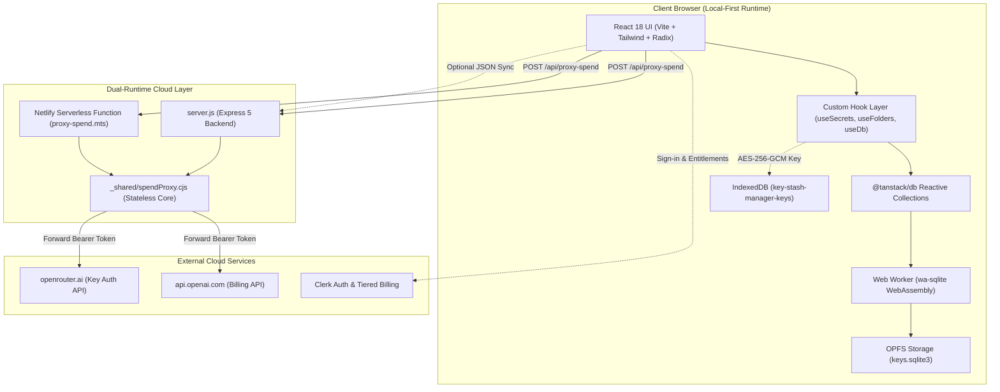
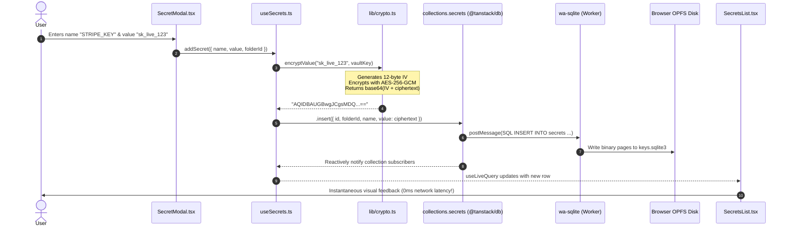

# 🏛️ Module 01: Architecture & Codebase Tour

> **Instructor**: "Before we start modifying engine parts, let's open the hood and understand how the entire vehicle is put together. Modern web applications rarely consist of a single isolated framework—they are orchestrated networks of client runtimes, serverless functions, and persistence layers."

---

## 🏗️ 1. High-Level Architecture Overview

Key Stash Manager uses a **hybrid client-centric architecture**. Unlike traditional web applications where a centralized server holds the authoritative database, KeyStash treats the **user's browser as the primary host of data execution and persistence**.



---

## 📂 2. File & Directory Anatomy

Let's walk through the project tree and understand the exact purpose of each directory and core file:

```
key-stash-manager/
├── package.json                 # Root backend dependencies (Express, sharp, zod v4)
├── server.js                    # Express server: optional sync & API spend proxy
├── compose.yaml                 # Docker Compose configuration for self-hosted deployments
├── Dockerfile                   # Multi-stage production container build
├── netlify.toml                 # Netlify routing, builds, and /api/* redirects
├── DOCS/                        # Architectural documentation, feature specs & learning guides
│   ├── CODEBASE.md              # Living architectural source of truth
│   ├── feat/                    # Feature specifications (e.g. encryption-at-rest.md)
│   └── codebase_learning/       # This bootcamp curriculum!
└── frontend/                    # Vite + React client workspace
    ├── package.json             # Client dependencies (React, TanStack DB, Radix, Clerk)
    ├── vite.config.ts           # Vite configuration, PWA plugin, worker optimization rules
    ├── tsconfig.json            # Root TS configuration
    ├── tsconfig.app.json        # Strict browser TypeScript configuration (strictNullChecks)
    ├── netlify/functions/       # Serverless function handlers
    │   ├── proxy-spend.mts      # Netlify handler entrypoint
    │   └── _shared/
    │       └── spendProxy.cjs   # The shared SSRF-safe proxy engine (CommonJS)
    └── src/
        ├── main.tsx             # DOM entrypoint, mounts React root into #root
        ├── App.tsx              # Root component: sets up ClerkProvider & DbProvider
        ├── index.css            # Global CSS & Tailwind design tokens
        ├── components/          # Reusable presentation components
        │   ├── FolderSidebar.tsx      # Folder navigation & drag-and-drop target
        │   ├── SecretsList.tsx        # Secrets table with multi-select checkboxes
        │   ├── secrets/               # Secret modal, row items, export dialogs
        │   ├── search/                # Cmd+K Global Search modal
        │   ├── spend/                 # API spend tracker dashboard & paywall
        │   └── ui/                    # shadcn/ui primitive wrappers (Button, Dialog, etc.)
        ├── hooks/               # State abstraction & reactive queries
        │   ├── useDb.tsx              # React Context providing DB collections & vaultKey
        │   ├── useSecrets.ts          # Reactive secrets queries, decryption, and mutations
        │   ├── useFolders.ts          # Reactive folder queries & reordering actions
        │   ├── useProfiles.ts         # Multi-profile switching logic
        │   └── useConfig.ts           # Reactive key-value store for app settings
        ├── lib/                 # Pure business logic, helpers, and utilities
        │   ├── crypto.ts              # Web Crypto API AES-GCM engine & IndexedDB key vault
        │   ├── e2eShare.ts            # One-time encrypted share token generator
        │   ├── reorder.ts             # Midpoint drag-and-drop calculation math
        │   ├── secretFilter.ts        # Search & query filtering builder
        │   ├── db/                    # TanStack DB database configurations
        │   │   ├── schema.ts          # Zod row schemas & database tables
        │   │   ├── collections.ts     # OPFS SQLite collection bootstrap
        │   │   └── migrations.ts      # Legacy v1 migration & first-run seeding
        │   └── spend/                 # Spend tracker provider adapters (OpenAI / OpenRouter)
        └── types/               # TypeScript domain interfaces and Zod wire schemas
```

---

## 🧩 3. The React 18 App Shell & Provider Hierarchy

In React 18, the tree structure defines how contexts, dependencies, and asynchronous boundaries cascade through your components. Let's look at how [frontend/src/App.tsx](file:///Users/aadilmallick/Documents/aadildev/projects/key-stash-manager/frontend/src/App.tsx) and [frontend/src/hooks/useDb.tsx](file:///Users/aadilmallick/Documents/aadildev/projects/key-stash-manager/frontend/src/hooks/useDb.tsx) structure our application:

```tsx
// Simplified conceptual view of App.tsx
export default function App() {
  // 1. Isolate testing environments: when VITE_IS_TESTING=true,
  // we bypass ClerkProvider completely to eliminate CDN/network overhead.
  if (env.VITE_IS_TESTING()) {
    return <AppShell />;
  }

  // 2. Production / Dev environment: wrap with ClerkProvider
  return (
    <ClerkProvider publishableKey={env.VITE_CLERK_PUBLISHABLE_KEY()}>
      <AppShell />
    </ClerkProvider>
  );
}

function AppShell() {
  return (
    // 3. DbProvider initializes wa-sqlite, OPFS, and the Web Crypto key
    <DbProvider>
      <AppStateProvider>
        <TooltipProvider>
          <DndProvider backend={HTML5Backend}>
            <Index />
            <Toaster richColors position="top-right" />
          </DndProvider>
        </TooltipProvider>
      </AppStateProvider>
    </DbProvider>
  );
}
```

### Why This Order Matters:
1. **`ClerkProvider` (Top)**: Must wrap everything so child components can check user identity and subscription tiers (`useAuth().has(...)`).
2. **`DbProvider`**: Asynchronous initialization boundary. Before rendering secrets, it resolves three critical dependencies in parallel:
   - Starts the SQLite WebAssembly Web Worker in OPFS.
   - Retrieves or generates the non-extractable AES-256-GCM `CryptoKey` from IndexedDB.
   - Preloads the `config` collection and seeds initial mock or migrated user data.
3. **`DndProvider`**: Mounts the HTML5 drag-and-drop backend so child rows and folders can register drag sources and drop targets.

---

## ⚡ 4. Tracing the Full End-to-End Data Flow

To understand the beauty of local-first engineering, let's trace exactly what happens when a user creates a new secret:



### Key Takeaway for Developers:
Notice that **no HTTP request was made** to complete the transaction! The user experience is immediate, offline-ready, and resilient. If the user's internet drops, KeyStash continues functioning without missing a beat.

---

## 🏋️ Bootcamp Lab Exercise 1

### Objective:
Verify your local environment and inspect the runtime architecture.

1. Open your terminal in the `frontend` directory:
   ```bash
   npm run test
   ```
   Notice that all unit tests run via **Vitest**. Look at how quickly they execute because pure logic (`crypto.ts`, `reorder.ts`) is separated from the DOM!
2. Inspect `frontend/src/lib/db/schema.ts`. Identify the 5 core collections:
   - `profiles`
   - `folders`
   - `secrets`
   - `config`
   - `spendProviders`
3. Ask yourself: *Why is `spendProviders` global instead of scoped to a `profileId`?*  
   *(Answer: API spend keys and LLM accounts belong to the user's developer machine or company account, not a single arbitrary folder profile!)*

---

Next, let's dive deep into the client database engine: [Module 02: The Local-First Data Layer](./02-local-first-data-layer.md).
