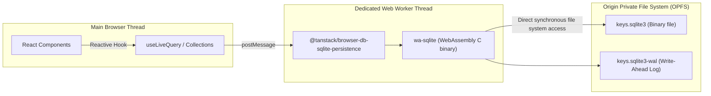

# 🗄️ Module 02: The Local-First Data Layer

> **Instructor**: "In web development history, we moved from server-rendered pages (1995) to client SPAs talking to REST APIs (2012). Today, we are in the third paradigm: **Local-First Software**. Let's discover how to embed an entire relational database engine inside the browser using WebAssembly and the Origin Private File System (OPFS)."

---

## 💾 1. What is "Local-First" Software?

In a traditional cloud-first app:
1. The user clicks "Create Secret".
2. A network spinner displays.
3. An HTTP POST request flies across the globe to a cloud database.
4. If the user is on an airplane, in a subway, or has spotty Wi-Fi, the app **breaks**.

In a **Local-First** app:
1. The primary database lives **directly on the client's device**.
2. Reads and writes execute in sub-millisecond memory/disk speeds.
3. The UI updates instantly.
4. Optional background synchronization occurs asynchronously without blocking the user.

### Browser Storage Comparison

| Storage Mechanism | Capacity | Speed | Relational / Indexing | Concurrency |
| :--- | :--- | :--- | :--- | :--- |
| **`localStorage`** | ~5 MB | Slow (Synchronous string serialization on UI thread) | None (Simple Key-Value) | Locks UI thread |
| **`IndexedDB`** | >1 GB | Moderate (Async callback/event API) | Basic b-tree indexes | Can have transactional contention |
| **`OPFS + wa-sqlite (WASM)`** | Virtually Unlimited (Gigabytes) | **Ultra Fast (Native binary pages via Web Worker)** | **Full SQL relational capability (ACID transactions, complex joins, B-trees)** | Isolated to Dedicated Web Worker |

---

## ⚙️ 2. The Engine: wa-sqlite & Origin Private File System (OPFS)

Key Stash Manager stores your data inside an embedded SQLite database running directly inside your browser!



### Why OPFS is a Game Changer:
The **Origin Private File System (OPFS)** provides web apps with a highly optimized, private file system accessible to the origin. Within a Web Worker, it exposes synchronous read/write handles (`FileSystemSyncAccessHandle`), allowing the compiled C SQLite engine to perform atomic, byte-level disk operations just like a native desktop app on macOS or Linux!

---

## 📐 3. Schema & Relational Collections

In KeyStash, collections are defined in [frontend/src/lib/db/schema.ts](file:///Users/aadilmallick/Documents/aadildev/projects/key-stash-manager/frontend/src/lib/db/schema.ts) using **Zod** schemas:

```typescript
// schema.ts
import { z } from "zod";

export const profileRowSchema = z.object({
  id: z.string(),
  name: z.string().min(1),
  createdAt: z.string(),
  updatedAt: z.string(),
});

export const folderRowSchema = z.object({
  id: z.string(),
  profileId: z.string(), // Foreign Key -> profiles.id
  name: z.string().min(1),
  order: z.number().optional(),
});

export const secretRowSchema = z.object({
  id: z.string(),
  folderId: z.string(), // Foreign Key -> folders.id
  name: z.string().min(1),
  value: z.string(), // Always CIPHERTEXT (base64(iv + aes-gcm))
  description: z.string().optional(),
  createdAt: z.string(),
  updatedAt: z.string(),
  order: z.number().optional(),
});

export const configRowSchema = z.object({
  key: z.string(),
  value: z.string(),
});

export const spendProviderRowSchema = z.object({
  id: z.string(),
  provider: z.enum(["openai", "openrouter"]),
  label: z.string().optional(),
  encryptedApiKey: z.string(),
  budgetUsd: z.number().optional(),
  lastSnapshot: z.string().optional(), // JSON string of SpendSnapshot
  lastError: z.string().optional(),
  createdAt: z.string(),
  updatedAt: z.string(),
});
```

### Collection Initialization & Indexing
In [frontend/src/lib/db/collections.ts](file:///Users/aadilmallick/Documents/aadildev/projects/key-stash-manager/frontend/src/lib/db/collections.ts), we instantiate the collections and create B-Tree indexes for fast foreign key lookups:

```typescript
import { createCollection } from "@tanstack/db";
import { BasicIndex } from "@tanstack/db";

// Foreign key index: accelerates querying folders by profileId
folders.createIndex("byProfileId", (row) => [row.profileId], {
  indexType: BasicIndex,
});

// Foreign key index: accelerates querying secrets by folderId
secrets.createIndex("byFolderId", (row) => [row.folderId], {
  indexType: BasicIndex,
});
```

---

## ⚡ 4. Reactive Queries with `useLiveQuery`

How do React components subscribe to database changes without polling or manual state management? Meet `useLiveQuery` from `@tanstack/react-db`.

Whenever an insert, update, or delete is committed to the collection, `useLiveQuery` automatically triggers a re-render with the freshest data:

```tsx
import { useLiveQuery } from "@tanstack/react-db";
import { eq } from "@tanstack/db";
import { useDb } from "@/hooks/useDb";

export function useFoldersForProfile(profileId: string | null) {
  const { collections } = useDb();

  return useLiveQuery(
    (q) => {
      if (!profileId) return [];
      return q
        .from({ folders: collections.folders })
        .where(({ folders }) => eq(folders.profileId, profileId));
    },
    [profileId]
  );
}
```

---

## ✏️ 5. Mutations: Insert, Delete, and Immer-Style Updates

`@tanstack/db` provides intuitive mutation operations on collection instances:

### 1. Insert:
```typescript
await collections.secrets.insert({
  id: crypto.randomUUID(),
  folderId,
  name: "DATABASE_URL",
  value: encryptedCiphertext,
  createdAt: new Date().toISOString(),
  updatedAt: new Date().toISOString(),
});
```

### 2. Delete:
```typescript
await collections.secrets.delete(secretId);
```

### 3. Immer-Style Updates:
Updates mutate a proxy "draft" rather than requiring you to spread and reconstruct objects manually:
```typescript
await collections.secrets.update(secretId, (draft) => {
  draft.name = "NEW_KEY_NAME";
  draft.updatedAt = new Date().toISOString();
});
```

### ⚠️ The Critical Gotcha: Single Loops vs. Batch Updates
During early testing of drag-and-drop reordering, we discovered a nasty bug: when looping individual `.update()` calls across multiple rows, fast page reloads occasionally caused **lost writes** because separate asynchronous transactions raced against OPFS disk flushing!

**The Solution**: Always use the **batch update** API when updating multiple rows:

```typescript
// ❌ WRONG: Looping individual updates races the OPFS worker!
for (const [id, order] of reorderedRows) {
  await collections.secrets.update(id, (draft) => { draft.order = order; });
}

// ✅ CORRECT: Atomically batch updates in a single transaction
const keys = Array.from(reorderedRows.keys());
await collections.secrets.update(keys, (drafts) => {
  drafts.forEach((draft) => {
    draft.order = reorderedRows.get(draft.id);
  });
});
```

---

## 🛠️ 6. Vite Pre-Bundling Gotchas (wa-sqlite)

In [frontend/vite.config.ts](file:///Users/aadilmallick/Documents/aadildev/projects/key-stash-manager/frontend/vite.config.ts), there is a crucial configuration setting:

```typescript
export default defineConfig({
  optimizeDeps: {
    exclude: [
      "@journeyapps/wa-sqlite",
      "@tanstack/browser-db-sqlite-persistence",
    ],
  },
});
```

### Why is this needed?
Vite's dev server attempts to pre-bundle npm dependencies into single `.js` files using `esbuild`. However, `@tanstack/browser-db-sqlite-persistence` contains an internal constructor:
```javascript
new Worker(new URL("./sqlite-worker.js", import.meta.url), { type: "module" })
```
If Vite pre-bundles this package, it flattens the relative URL resolution, causing Vite to mistakenly serve `index.html` instead of the worker script, which silently crashes database initialization! Excluding these packages from `optimizeDeps` tells Vite to preserve native module resolution.

---

## 🏋️ Bootcamp Lab Exercise 2

### Objective:
Practice using collection queries and draft mutations.

1. Open `frontend/src/hooks/useFolders.ts`.
2. Inspect `useFolderActions()`. Notice how `deleteFolder` handles **manual cascade deletion**:
   ```typescript
   // Collections do not automatically enforce relational cascading:
   const folderSecrets = await collections.secrets.toArray();
   const secretsToDelete = folderSecrets.filter((s) => s.folderId === folderId);
   for (const secret of secretsToDelete) {
     await collections.secrets.delete(secret.id);
   }
   await collections.folders.delete(folderId);
   ```
3. Challenge: Write a TypeScript function that queries all secrets across all folders for a specific `profileId` by joining `collections.folders` and `collections.secrets`.

---

Ready for security? Proceed to [Module 03: Cryptography 101 & Encryption at Rest](./03-cryptography-101-and-encryption-at-rest.md).
