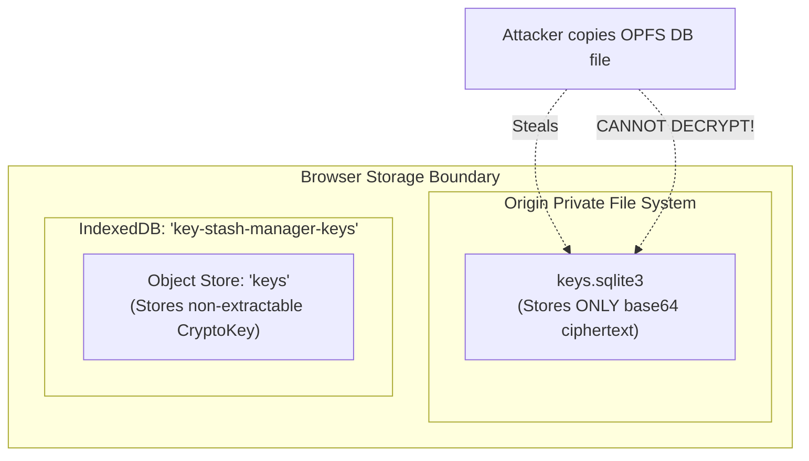

# 🔐 Module 03: Cryptography 101 & Encryption at Rest

> **Instructor**: "Rule #1 of cryptography: *Never roll your own crypto algorithm.* Rule #2: *Always use authenticated ciphers.* In this module, we will explore the Web Crypto API, why AES-256-GCM is the industry benchmark, and how KeyStash protects secrets at rest using non-extractable hardware-isolated keys."

---

## 🧮 1. Cryptography Fundamentals for Web Developers

To build a secure vault, we must first master the fundamental vocabulary of modern encryption:

### Symmetric vs. Asymmetric Encryption
* **Symmetric Encryption**: The **same key** is used to both encrypt and decrypt data. Fast, hardware-accelerated, ideal for encrypting large datasets or database records (e.g. AES-256-GCM).
* **Asymmetric Encryption**: Uses a **key pair** (Public Key + Private Key). Data encrypted with the public key can only be decrypted by the matching private key (e.g. RSA, ECDH, WebAuthn). Slower, but solves the key-distribution problem.

### What is AES-GCM?
**AES (Advanced Encryption Standard)** is a symmetric block cipher that operates on 128-bit blocks of data with 128, 192, or 256-bit keys.

Older modes like **CBC (Cipher Block Chaining)** only provided *confidentiality* (an attacker couldn't read the data), but lacked *authenticity* (an attacker could tamper with ciphertext bits in transit, leading to padding oracle attacks).

**GCM (Galois/Counter Mode)** is an **AEAD (Authenticated Encryption with Associated Data)** mode:
1. It encrypts the plaintext.
2. It simultaneously computes an **authentication tag** (128-bit checksum).
3. If even a single bit of the ciphertext or tag is modified, decryption **fails completely**, guaranteeing both confidentiality and tamper resistance.

```
       Plaintext ───┐
                    ├──▶ [ AES-256-GCM Cipher ] ──▶ Ciphertext + Auth Tag (16 bytes)
Key + IV (12 bytes) ┘
```

### The Critical Rule of IVs (Initialization Vectors)
AES-GCM requires a unique **Initialization Vector (IV)** for every single encryption operation under the same key:
* Standard IV size is **12 bytes (96 bits)**.
* **NEVER reuse an IV with the same key!** Reusing an IV destroys the authenticity guarantee and can leak plaintext XOR differences.
* In KeyStash, we generate a fresh, cryptographically secure 12-byte IV for every secret via `crypto.getRandomValues(new Uint8Array(12))`.

---

## 🛡️ 2. The Storage Isolation Architecture

Where do we store the encryption key? If we store the key in the SQLite database right next to the encrypted secrets, anyone who copies the `.sqlite3` file gets both the lock and the key!

KeyStash implements **Physical Browser Storage Separation**:



* **The Database (OPFS)**: Holds all relational structures (profiles, folders, secret metadata), but `secrets.value` is strictly stored as encrypted ciphertext.
* **The Key Vault (IndexedDB)**: Holds the raw `CryptoKey`. Modern browsers allow structured-cloning of `CryptoKey` objects directly into IndexedDB without exposing raw binary key bytes.

---

## 🔍 3. In-Depth Code Walkthrough: `crypto.ts`

Let's dissect [frontend/src/lib/crypto.ts](file:///Users/aadilmallick/Documents/aadildev/projects/key-stash-manager/frontend/src/lib/crypto.ts) line by line.

### A. Non-Extractable Key Generation
When an encryption key is marked as `extractable: false`, the browser's JavaScript runtime will actively refuse to export the raw key material:

```typescript
const generatedKey = await crypto.subtle.generateKey(
  {
    name: "AES-GCM",
    length: 256, // 256-bit AES encryption
  },
  false, // <-- extractable: false! Raw bytes cannot be exfiltrated
  ["encrypt", "decrypt"]
);
```

Even if an attacker runs malicious JavaScript in your console:
```javascript
// Attacker tries to export the key:
await crypto.subtle.exportKey("raw", vaultKey);
// ❌ Uncaught DOMException: The key is not extractable!
```

---

### B. The In-Flight Promise Guard (Handling React StrictMode)
In React 18 development mode, `StrictMode` intentionally mounts and unmounts components twice to catch side-effects. 

If two components call `getOrCreateVaultKey()` simultaneously on first launch, without a guard, both calls would check IndexedDB, see "empty", generate **two different keys**, and race to write them! The second key would overwrite the first, rendering anything encrypted with the first key permanently unreadable.

KeyStash solves this with an **in-flight promise pattern**:

```typescript
let memoizedKey: CryptoKey | null = null;
let keyPromise: Promise<CryptoKey> | null = null;

export function getOrCreateVaultKey(): Promise<CryptoKey> {
  // 1. If key is already in memory, return immediately
  if (memoizedKey) return Promise.resolve(memoizedKey);

  // 2. If a key lookup/generation is already in progress, share that same promise!
  if (!keyPromise) {
    keyPromise = loadOrCreateVaultKey().catch((error) => {
      keyPromise = null; // Reset on failure to allow retry
      throw error;
    });
  }
  return keyPromise;
}
```

---

### C. Encrypting a Value
Let's see how `encryptValue` packages the IV and ciphertext together:

```typescript
export async function encryptValue(
  plaintext: string,
  key: CryptoKey,
): Promise<string> {
  // 1. Generate a fresh 12-byte random IV
  const iv = crypto.getRandomValues(new Uint8Array(12));

  // 2. Encrypt plaintext into ArrayBuffer
  const ciphertext = await crypto.subtle.encrypt(
    { name: "AES-GCM", iv },
    key,
    new TextEncoder().encode(plaintext),
  );

  // 3. Prepend IV to the ciphertext: [ 12 bytes IV | N bytes Ciphertext + Tag ]
  const combined = new Uint8Array(iv.length + ciphertext.byteLength);
  combined.set(iv, 0);
  combined.set(new Uint8Array(ciphertext), iv.length);

  // 4. Encode the combined buffer into a clean Base64 string for storage
  return bufferToBase64(combined);
}
```

---

### D. Decrypting a Value
Decryption reverses the process, extracting the 12-byte IV from the front of the buffer:

```typescript
export async function decryptValue(
  ciphertext: string,
  key: CryptoKey,
): Promise<string> {
  const combined = base64ToBuffer(ciphertext);
  
  // Guard: Must at least have 12 bytes IV + 16 bytes minimum auth tag = 28 bytes
  if (combined.length <= 12) {
    throw new Error("Ciphertext is too short to contain an IV and payload");
  }

  // 1. Slice off the first 12 bytes as IV
  const iv = combined.slice(0, 12);
  // 2. The remainder is ciphertext + authentication tag
  const data = combined.slice(12);

  // 3. Web Crypto decrypts and validates the authentication tag in one step
  const plaintext = await crypto.subtle.decrypt(
    { name: "AES-GCM", iv },
    key,
    data,
  );

  return new TextDecoder().decode(plaintext);
}
```

---

## ⚖️ 4. Security Threat Model

As engineers, we must always define what our security model **protects** and what it **does not protect**:

| Threat | Protected? | Explanation |
| :--- | :---: | :--- |
| **Physical Disk Inspection** | ✅ **YES** | If someone steals a backup of `keys.sqlite3`, all secret values are unreadable AES-GCM ciphertext. |
| **Key Exfiltration via Console** | ✅ **YES** | Keys are `extractable: false`. Even an injected script cannot call `exportKey()` to steal the raw private key bytes over the network. |
| **Cross-Site Scripting (XSS)** | ⚠️ **PARTIAL** | While an attacker cannot steal the key bytes, an XSS payload could still invoke `crypto.subtle.decrypt(..., key)` within the active session. *(To protect against this, you need a Master Password or WebAuthn biometric prompt before every decryption, which we cover in Modules 04 & 05!)* |

---

## 🏋️ Bootcamp Lab Exercise 3

### Objective:
Test your understanding of the Web Crypto API by writing a self-contained test script.

1. Open `frontend/src/lib/crypto.test.ts`.
2. Run the crypto test suite:
   ```bash
   cd frontend && npx vitest run src/lib/crypto.test.ts
   ```
3. Notice how `vitest.config.ts` uses `fake-indexeddb/auto` so IndexedDB operations work inside Node.js during testing!
4. Challenge: Write a test verifying that modifying a single character of an encrypted ciphertext causes `decryptValue` to throw an error (demonstrating AES-GCM's authentication integrity check).

---

Now that we understand encryption at rest, let's explore how to share secrets securely without sharing keys: [Module 04: End-to-End Encryption Deep Dive](./04-end-to-end-encryption-deep-dive.md).
