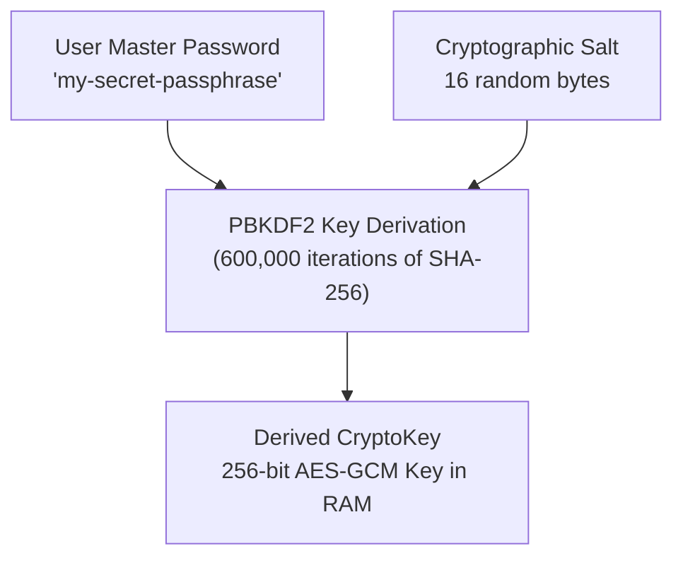

# 🛡️ Module 04: End-to-End Encryption Deep Dive

> **Instructor**: "In cloud architecture, 'Zero-Knowledge' is not an insult—it is the highest honor! It means the server host can be completely compromised, subpoenaed, or hacked, yet an attacker learns absolutely nothing about user data. Let's see how to design Zero-Knowledge E2E encryption systems using key stretching and ephemeral token sharing."

---

## 🔒 1. What is "Zero-Knowledge" Architecture?

In traditional SaaS (e.g. AWS Secrets Manager, standard cloud databases):
* Data is encrypted in transit via HTTPS (TLS).
* Data is encrypted at rest using server-side keys managed by AWS KMS.
* **The Catch**: The cloud server holds the decryption keys. A rogue employee, a malicious cloud provider, or a compromised database container can inspect and decrypt all records in plaintext.

In a **Zero-Knowledge / End-to-End Encrypted (E2EE)** system:
1. Encryption occurs **client-side** in the user's browser before data ever touches a network cable or storage disk.
2. The server functions purely as a "blind relay" or storage bucket.
3. The encryption keys **never leave the user's device**.

```
[ User Browser ]                                           [ Cloud Server ]
 Plaintext Secret
      │
      ▼
 (Web Crypto) ──▶ Encrypted Ciphertext ──[ HTTPS Post ]──▶ Stores Ciphertext
 (Key in RAM)                                              (CANNOT READ VALUE!)
```

---

## 🔑 2. Master Passphrase Derivation (PBKDF2 + AES-GCM)

How do password managers like 1Password and Bitwarden derive 256-bit cryptographic keys from human-typed passwords?

### The Problem of Human Passwords
A 256-bit AES key requires 256 bits of pure cryptographic entropy. A human password like `"P@ssword123!"` has only ~30 bits of entropy. If an attacker gets the ciphertext, they could brute-force millions of password guesses per second using GPUs!

### The Solution: Key Stretching (PBKDF2)
**PBKDF2 (Password-Based Key Derivation Function 2)** solves this through intentional computational delay:
1. **Salt**: A random 16-byte value prepended to the password, ensuring that two users with the exact same password produce totally different keys (destroying pre-computed rainbow tables).
2. **Iteration Count**: A massive loop (e.g. **600,000 rounds** of HMAC-SHA256, per OWASP guidelines). This takes ~150 milliseconds on a user's CPU, but makes brute-force attacks computationally impossible for an attacker!



---

## 💻 3. Implementing PBKDF2 in the Web Crypto API

Here is the complete, battle-tested implementation of a Master Password vault derived with `crypto.subtle`:

```typescript
// crypto-vault.ts
const PBKDF2_ITERATIONS = 600_000;

export interface EncryptedPayload {
  cipherText: string; // Base64
  iv: string;         // Base64
  salt: string;       // Base64
}

// 1. Derive an AES-GCM encryption key from a user password and salt
export async function deriveKeyFromPassword(
  password: string,
  salt: Uint8Array,
): Promise<CryptoKey> {
  const enc = new TextEncoder();
  
  // Import raw password string as a base PBKDF2 key
  const baseKey = await crypto.subtle.importKey(
    "raw",
    enc.encode(password),
    { name: "PBKDF2" },
    false,
    ["deriveKey"],
  );

  // Stretch the key over 600,000 iterations into a 256-bit AES-GCM key
  return crypto.subtle.deriveKey(
    {
      name: "PBKDF2",
      salt: salt,
      iterations: PBKDF2_ITERATIONS,
      hash: "SHA-256",
    },
    baseKey,
    { name: "AES-GCM", length: 256 },
    false, // Non-extractable: cannot be exported back out to JS
    ["encrypt", "decrypt"],
  );
}
```

### Memory Hygiene & Auto-Locking
When building zero-knowledge web apps, keys must never linger indefinitely in browser memory:
* **Session Timeout**: When the user is inactive for 15 minutes, clear the `CryptoKey` reference (`vaultKey = null`).
* **Page Unload / Tab Close**: The browser's garbage collector immediately purges RAM.
* **Unlock Prompt**: The user re-enters their master password to re-derive the key on demand.

---

## 🚀 4. Ephemeral Key Sharing: How KeyStash Shares Secrets

In KeyStash, we wanted users to be able to send an encrypted secret to a colleague **without creating an account, without trusting a centralized server, and without sharing their master vault key**.

Take a look at [frontend/src/lib/e2eShare.ts](file:///Users/aadilmallick/Documents/aadildev/projects/key-stash-manager/frontend/src/lib/e2eShare.ts):

```typescript
import {
  base64ToBuffer,
  bufferToBase64,
  decryptValue,
  encryptValue,
} from "@/lib/crypto";

export interface EncryptedShare {
  ciphertext: string;
  token: string;
}

// 1. Sender encrypts a secret with a FRESH, ONE-TIME key
export async function encryptForSharing(
  plaintext: string,
): Promise<EncryptedShare> {
  // Generate a random 256-bit key used ONLY for this specific share
  const key = await crypto.subtle.generateKey(
    { name: "AES-GCM", length: 256 },
    true, // extractable: true because we must export the key as the share token!
    ["encrypt", "decrypt"],
  );

  // Encrypt the plaintext using the one-time key
  const ciphertext = await encryptValue(plaintext, key);

  // Export the raw key bytes and convert them into a pasteable Base64 token
  const rawKey = await crypto.subtle.exportKey("raw", key);
  return { ciphertext, token: bufferToBase64(rawKey) };
}

// 2. Recipient decrypts the secret using the token
export async function decryptFromSharing(
  ciphertext: string,
  token: string,
): Promise<string> {
  const rawKey = base64ToBuffer(token);

  // Import the token back into a valid CryptoKey
  const key = await crypto.subtle.importKey(
    "raw",
    rawKey,
    { name: "AES-GCM" },
    false,
    ["decrypt"],
  );

  return decryptValue(ciphertext, key);
}
```

### 🛰️ The Two-Channel Security Architecture:
Why is this design secure? Because it relies on **Out-of-Band (OOB) Channel Separation**:

```
Sender ───────── [ Email or Public Slack ] ─────────▶ Encrypted Ciphertext File
       ───────── [ Encrypted Signal / SMS ] ────────▶ Decryption Token (One-time Key)
```

Even if an attacker intercepts the ciphertext file on public Slack or email, without the out-of-band token sent over Signal, the file is completely unbreakable mathematical noise!

---

## 🤝 5. Multi-User Team Vaults (Hybrid Cryptography)

What if you want to share a vault among a team of 10 engineers?

In a team vault:
1. Each user generates an **asymmetric key pair** (e.g. RSA-OAEP or ECDH).
2. The team vault has a single symmetric **Vault Key** (AES-256-GCM).
3. When adding Alice to the team:
   - Bob decrypts the Vault Key.
   - Bob encrypts the Vault Key with **Alice's Public Key**.
   - Bob stores Alice's encrypted copy on the server.
4. When Alice logs in:
   - Alice uses her **Private Key** to decrypt the Vault Key.
   - Alice now has access to all team secrets!
5. If Alice leaves the team, the Vault Key is rotated and re-encrypted for remaining members.

---

## 🏋️ Bootcamp Lab Exercise 4

### Objective:
Verify one-time ephemeral sharing in the test suite.

1. Open `frontend/src/lib/e2eShare.test.ts`.
2. Notice how simple and elegant the test is:
   ```typescript
   it("round-trips encryption and decryption", async () => {
     const secret = "super-secret-api-key-12345";
     const share = await encryptForSharing(secret);
     const decrypted = await decryptFromSharing(share.ciphertext, share.token);
     expect(decrypted).toBe(secret);
   });
   ```
3. Run the test:
   ```bash
   cd frontend && npx vitest run src/lib/e2eShare.test.ts
   ```
4. Challenge: Write a test verifying that passing an invalid or corrupted `token` to `decryptFromSharing` throws a decryption failure.

---

What if we could unlock vaults using our fingerprint or FaceID? Proceed to [Module 05: WebAuthn & Hardware Passkeys](./05-webauthn-and-hardware-passkeys.md).
