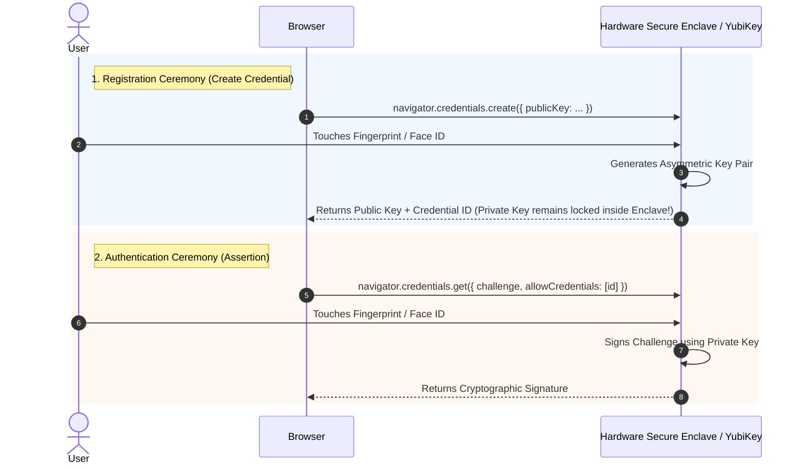

# 🪪 Module 05: WebAuthn & Hardware Passkeys

> **Instructor**: "For decades, security meant typing 20-character passwords with symbols and capital letters. Today, we have Secure Enclaves in our phones and laptops. In this module, we will explore the cutting edge of browser authentication: **WebAuthn Passkeys** and the revolutionary **PRF (Pseudo-Random Function) extension** that turns your fingerprint into a cryptographic decryption key."

---

## 🛑 1. Why Passwords Fail Humans

Master passwords suffer from two fatal vulnerabilities:
1. **Human Psychology**: Users forget complex passphrases or write them on sticky notes, or use weak passwords that can be brute-forced.
2. **Phishing & Keyloggers**: If a user types their master password into a malicious phishing domain or a machine with malware, their entire digital life is compromised.

### The FIDO2 / WebAuthn Solution
**WebAuthn (Web Authentication)** is a W3C web standard that replaces passwords with asymmetric cryptography backed by hardware:
* **Hardware-Bound Authenticators**: Apple Touch ID / Face ID (Secure Enclave), Windows Hello (TPM), Android Biometrics, and hardware security keys (YubiKey).
* **Domain Binding**: The browser enforces that authenticators will only answer challenges for the exact registered origin (e.g. `keystash.app`). Phishing is **mathematically impossible** because an authenticator will never sign a challenge for `fake-keystash.com`!

---

## 🎭 2. The Two Standard WebAuthn Ceremonies

WebAuthn works through two distinct ceremonies:



---

## 🤯 3. The Core Dilemma: Authentication vs. Encryption

Here is the puzzle that stumped security engineers for years:
> *"WebAuthn is great for signing in, but how do we use it to encrypt a local database?"*

Standard WebAuthn only generates **digital signatures** (`sign(challenge, privateKey)`). The browser:
* Cannot see the private key.
* Cannot pass a database record to the hardware key to decrypt it.

If an app only uses standard WebAuthn, it can authenticate the user, but if the local database is encrypted on disk, **where does the encryption key come from?** Storing the encryption key in localStorage completely defeats the purpose!

---

## ⚡ 4. The Breakthrough: The WebAuthn PRF Extension

Enter the **WebAuthn PRF (Pseudo-Random Function) Extension** (`hmac-secret`).

### How It Works:
1. When you authenticate with your passkey, the browser passes an input salt (e.g., `"keystash-vault-derivation-salt-v1"`) to the authenticator.
2. Inside the hardware chip, the authenticator computes a deterministic pseudorandom function:
   $$\text{Secret} = \text{HMAC-SHA-256}(\text{HardwareKey}, \text{Salt})$$
3. The hardware returns a unique **32-byte symmetric secret** to the browser.
4. Whenever the user touches their fingerprint for that credential, the authenticator outputs the **exact same 32-byte secret**.
5. The browser uses this secret to derive an **AES-256-GCM vault key via HKDF**.

```
[ User Biometric Touch ]
           │
           ▼
[ Hardware Enclave ] ──(HMAC-SHA-256 with Salt)──▶ 32-byte Raw Secret
                                                          │
                                                          ▼
                                            [ Web Crypto API: HKDF ]
                                                          │
                                                          ▼
                                            [ 256-bit AES-GCM Vault Key ]
                                                          │
                                                          ▼
                                            [ Decrypts Local Database! ]
```

---

## 💻 5. Full Implementation: Deriving Vault Keys from Passkeys

Here is the complete production implementation in TypeScript using modern WebAuthn PRF:

```typescript
// webauthn-prf.ts
const PRF_SALT = new TextEncoder().encode("keystash-vault-derivation-salt-v1");

export async function deriveKeyFromPasskey(
  credentialId: Uint8Array,
): Promise<CryptoKey> {
  const challenge = crypto.getRandomValues(new Uint8Array(32));

  // 1. Request WebAuthn assertion with the PRF extension enabled
  const assertion = (await navigator.credentials.get({
    publicKey: {
      challenge,
      allowCredentials: [
        {
          id: credentialId,
          type: "public-key",
          transports: ["internal", "hybrid", "usb"],
        },
      ],
      userVerification: "required", // Forces TouchID / FaceID prompt
      extensions: {
        prf: {
          eval: { first: PRF_SALT },
        },
      } as any,
    },
  })) as PublicKeyCredential;

  // 2. Extract the PRF extension output from the authenticator
  const extensionResults: any = assertion.getClientExtensionResults();
  if (!extensionResults.prf?.results?.first) {
    throw new Error(
      "WebAuthn PRF extension is not supported on this device or browser.",
    );
  }

  // 32-byte raw deterministic secret directly from hardware!
  const rawDerivedSecret: ArrayBuffer = extensionResults.prf.results.first;

  // 3. Import the hardware secret into Web Crypto as HKDF key material
  const prfKeyMaterial = await crypto.subtle.importKey(
    "raw",
    rawDerivedSecret,
    "HKDF",
    false,
    ["deriveKey"],
  );

  // 4. Derive the final AES-256-GCM Vault Decryption Key
  return crypto.subtle.deriveKey(
    {
      name: "HKDF",
      salt: new Uint8Array(32), // Optional secondary salt
      info: new TextEncoder().encode("keystash-vault-aes-key"),
      hash: "SHA-256",
    },
    prfKeyMaterial,
    { name: "AES-GCM", length: 256 },
    false, // Non-extractable
    ["encrypt", "decrypt"],
  );
}
```

---

## 🌐 6. Browser Support & Tiered Strategy

As of 2025/2026:
* **Chromium (Chrome, Edge, Brave, Opera)**: Supported since Chrome 116+.
* **Apple (macOS & iOS)**: Supported in Safari 18+ and native WebKit.
* **Firefox**: In active development / Nightly flag.

### Recommended Progressive Enhancement Matrix:

| User Environment | Strategy | UX Experience |
| :--- | :--- | :--- |
| **Modern Browser + Biometrics** | **WebAuthn PRF** | Instant fingerprint / Face ID prompt, hardware security enclave. |
| **Desktop without Biometrics** | **Master Password (PBKDF2)** | User enters password, derived via 600,000 PBKDF2 iterations. |
| **Offline Single-Device App** | **Device-Bound Key (IndexedDB)** | Zero friction, non-extractable key in IndexedDB (KeyStash default). |

---

## 🏋️ Bootcamp Lab Exercise 5

### Objective:
Inspect the WebAuthn features on your current machine.

1. Open your browser's Developer Tools (Console) on any HTTPS website.
2. Run this quick feature-detection snippet:
   ```javascript
   const isWebAuthnAvailable = !!window.PublicKeyCredential;
   console.log("WebAuthn Supported:", isWebAuthnAvailable);

   if (isWebAuthnAvailable) {
     PublicKeyCredential.isUserVerifyingPlatformAuthenticatorAvailable()
       .then(result => console.log("Biometric Authenticator (TouchID/FaceID) Available:", result));
   }
   ```
3. Question: Why must WebAuthn ceremonies be initiated by a **direct user gesture** (like a button click)?  
   *(Answer: Browsers prevent drive-by fingerprint prompts; `navigator.credentials.get` will throw a SecurityError if invoked without transient user activation!)*

---

Next up: building beautiful, accessible user interfaces! Proceed to [Module 06: UI Component Architecture (Radix, Tailwind & shadcn)](./06-ui-component-architecture-radix-shadcn-tailwind.md).
