# 🖱️ Module 07: Forms, Validation & Drag-and-Drop

> **Instructor**: "Two of the most complex UI challenges in web engineering are: (1) high-performance forms with bulletproof runtime validation, and (2) desktop-grade drag-and-drop list reordering. In this module, we will conquer both using React Hook Form, Zod, and React-DnD."

---

## 📝 1. High-Performance Forms with React Hook Form & Zod

In standard React tutorials, beginner developers often build controlled forms:

```tsx
// ❌ NAIVE CONTROLLED FORM: Re-renders the entire component on every single keystroke!
const [name, setName] = useState("");
<input value={name} onChange={(e) => setName(e.target.value)} />
```

In large forms or modal dialogs, re-rendering on every keystroke hurts performance, disrupts focus, and drains mobile battery.

### Enter `react-hook-form`
`react-hook-form` uses **uncontrolled components with refs**:
* It hooks into native browser DOM inputs directly.
* Typing into an input **does not trigger React re-renders**.
* React is only notified when submitting or validating errors!

```mermaid
graph LR
    UserKeystroke["User Types 'STRIPE_SECRET'"]
    DOMInput["Native HTML <input>"]
    RHFRef["react-hook-form Ref (No Re-render)"]
    ZodResolver["zodResolver(secretSchema)"]
    FormSubmit["handleSubmit(onSubmit)"]

    UserKeystroke --> DOMInput
    DOMInput --> RHFRef
    RHFRef -->|On Submit or Blur| ZodResolver
    ZodResolver -->|If Valid| FormSubmit
    ZodResolver -.->|If Invalid| FormErrorUI["Inline Form Error Alert"]
```



---

## 🔒 2. Type-Safe Schema Validation with Zod

In TypeScript, interfaces only exist at compile time—they vanish completely once compiled to JavaScript. To validate user inputs at **runtime**, we use **Zod**:

```typescript
// 1. Define runtime validation schema
import { z } from "zod";

export const secretFormSchema = z.object({
  name: z
    .string()
    .min(1, "Secret name cannot be empty")
    .max(100, "Secret name is too long")
    .regex(/^[A-Z0-9_-]+$/, "Name should contain only uppercase letters, numbers, and underscores"),
  value: z
    .string()
    .min(1, "Secret value cannot be empty"),
  description: z.string().optional(),
});

// 2. Infer the TypeScript type automatically from the schema!
export type SecretFormData = z.infer<typeof secretFormSchema>;
```

### Wiring into React Hook Form:
```tsx
import { useForm } from "react-hook-form";
import { zodResolver } from "@hookform/resolvers/zod";

export function SecretModal() {
  const {
    register,
    handleSubmit,
    formState: { errors, isSubmitting },
  } = useForm<SecretFormData>({
    resolver: zodResolver(secretFormSchema),
  });

  const onSubmit = async (data: SecretFormData) => {
    // Guaranteed to be valid and type-safe!
    await saveSecret(data);
  };

  return (
    <form onSubmit={handleSubmit(onSubmit)} className="space-y-4">
      <div>
        <label className="text-sm font-medium">Secret Name</label>
        <input {...register("name")} className="border rounded p-2 w-full" />
        {errors.name && (
          <p className="text-destructive text-xs mt-1">{errors.name.message}</p>
        )}
      </div>

      <button type="submit" disabled={isSubmitting}>
        {isSubmitting ? "Encrypting..." : "Save Secret"}
      </button>
    </form>
  );
}
```

---

## 🎯 3. Desktop Drag-and-Drop with `react-dnd`

Key Stash Manager provides two fluid drag-and-drop interactions:
1. **Folder Reordering**: Drag a folder above or below another folder to change their display sequence.
2. **Secret Cross-Folder Move**: Drag a secret card from the main list and drop it onto a folder in the sidebar to move it!

### The Multi-Type Drop Target Pattern
In [frontend/src/components/FolderSidebar.tsx](file:///Users/aadilmallick/Documents/aadildev/projects/key-stash-manager/frontend/src/components/FolderSidebar.tsx), each folder row is both a **Drag Source** and a **Multi-Type Drop Target**:

```typescript
// frontend/src/lib/dnd/itemTypes.ts
export const ItemTypes = {
  FOLDER: "FOLDER",
  SECRET: "SECRET",
} as const;
```

```tsx
// Inside FolderRowItem component
const [{ isDragging }, dragRef, previewRef] = useDrag({
  type: ItemTypes.FOLDER,
  item: { id: folder.id, index },
  collect: (monitor) => ({ isDragging: monitor.isDragging() }),
});

const [{ isOver, canDrop }, dropRef] = useDrop({
  // Accept BOTH folders (for reordering) AND secrets (for moving)!
  accept: [ItemTypes.FOLDER, ItemTypes.SECRET],
  drop: (item: any, monitor) => {
    const itemType = monitor.getItemType();

    if (itemType === ItemTypes.FOLDER) {
      // Handle Folder Reordering
      onReorderFolder(item.id, folder.id);
    } else if (itemType === ItemTypes.SECRET) {
      // Handle Moving Secret into this Folder
      onMoveSecretToFolder(item.id, folder.id);
    }
  },
  collect: (monitor) => ({
    isOver: monitor.isOver({ shallow: true }),
    canDrop: monitor.canDrop(),
  }),
});
```

---

## 📐 4. The Mathematics of Midpoint Reordering

Many naive drag-and-drop implementations reshuffle the live UI list on hover. This causes severe **layout jitter**—the element you are hovering over jumps away from your cursor!

### Reorder on Drop
KeyStash computes reordering **strictly when the drop occurs**, using cursor midpoint mathematics in [frontend/src/lib/reorder.ts](file:///Users/aadilmallick/Documents/aadildev/projects/key-stash-manager/frontend/src/lib/reorder.ts):

```
┌──────────────────────────────────────┐
│ Target Row Top                       │
│                                      │  <-- Top 50%: Insert BEFORE target
│ - - - - - - [ Vertical Midpoint ] - -│
│                                      │  <-- Bottom 50%: Insert AFTER target
│ Target Row Bottom                    │
└──────────────────────────────────────┘
```

```typescript
// frontend/src/lib/reorder.ts
export function computeReorderedIds(
  orderedIds: string[],
  draggedId: string,
  targetId: string,
  dropPosition: "before" | "after",
): string[] {
  // 1. Remove the dragged item from its current position
  const withoutDragged = orderedIds.filter((id) => id !== draggedId);

  // 2. Locate target index
  const targetIndex = withoutDragged.indexOf(targetId);
  if (targetIndex === -1) return orderedIds;

  // 3. Compute insert index based on midpoint calculation
  const insertIndex = dropPosition === "before" ? targetIndex : targetIndex + 1;

  // 4. Splice dragged item into new position
  const result = [...withoutDragged];
  result.splice(insertIndex, 0, draggedId);
  return result;
}
```

---

## ⚡ 5. Atomic Batch Persistence

Once `computeReorderedIds` returns the new sequence `["folder-B", "folder-A", "folder-C"]`, how do we save this order to the database?

As we learned in Module 02, updating individual rows sequentially in an OPFS WebAssembly worker races against page reloads.

We persist the new sequence in **one single batch transaction**:

```typescript
export async function reorderFolders(newOrderIds: string[]) {
  // Batch update all changed row indices in one atomic disk operation
  await collections.folders.update(newOrderIds, (drafts) => {
    drafts.forEach((draft) => {
      draft.order = newOrderIds.indexOf(draft.id);
    });
  });
}
```

---

## 🏋️ Bootcamp Lab Exercise 7

### Objective:
Inspect and test the reordering logic in isolation.

1. Open `frontend/src/lib/reorder.test.ts`.
2. Run the test suite:
   ```bash
   cd frontend && npx vitest run src/lib/reorder.test.ts
   ```
3. Look at the test cases:
   - Moving an item downward past another item.
   - Moving an item upward.
   - Dropping an item onto itself (should return unchanged array).
4. Challenge: Consider how you would implement collision detection when moving a secret into a folder that already contains a secret with the same name. Where in the codebase is that collision check performed?  
   *(Hint: Check `useSecretActions().findDuplicateInFolder` in `frontend/src/hooks/useSecrets.ts`!)*

---

Next up: tracking LLM costs! Proceed to [Module 08: Tracking API Spend & Proxy Architecture](./08-tracking-api-spend-and-proxy-architecture.md).
