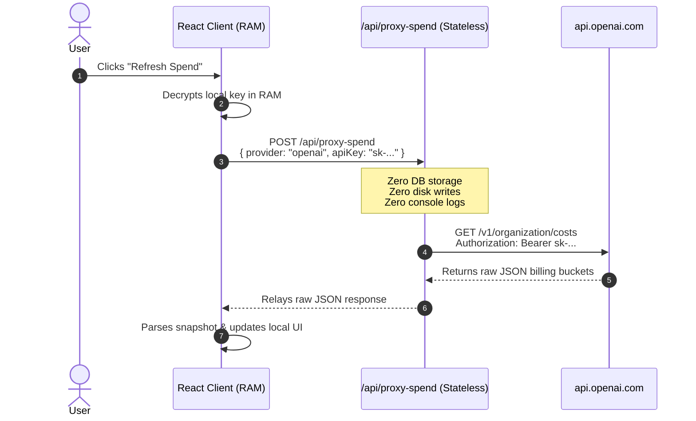

# 💳 Module 08: Tracking API Spend & Proxy Architecture

> **Instructor**: "In an era of generative AI, API spend can spiral out of control overnight. In this module, we will explore the economics of LLM APIs, why web browsers cannot directly query provider billing endpoints, and how to build a stateless, SSRF-resistant proxy that bridges CORS gaps without ever persisting user secrets."

---

## 🛑 1. Why API Spend Needs a Proxy

Key Stash Manager stores API keys locally on your machine. So why can't the React frontend simply make a direct `fetch()` call to OpenAI to check how much money you've spent this month?

### The CORS Brick Wall
Modern web security enforces **CORS (Cross-Origin Resource Sharing)**:
* When your app running at `http://localhost:5173` calls `https://api.openai.com/v1/organization/costs`, the browser sends an HTTP `OPTIONS` preflight request.
* OpenAI’s billing and organization endpoints **do not return permissive CORS headers** (`Access-Control-Allow-Origin: *`).
* The browser automatically blocks the request and throws a `TypeError: Failed to fetch (CORS Network Error)`.

```
[ Browser: keystash.app ] ───(Direct fetch)───▶ [ api.openai.com ]
           ▲                                          │
           └─────────── BLOCKED BY CORS! ─────────────┘
```

Upstream providers intentionally block browser CORS on billing endpoints to prevent malicious websites from using your session cookies or browser credentials to inspect your organizational bills!

---

## 🛡️ 2. The Stateless, Zero-Logging Cloud Relay

We need a backend to make the server-to-server call. But KeyStash is a **zero-knowledge, local-first app**. We refuse to maintain a central database that stores user API keys!

### The Architectural Solution:
1. The user's encrypted API key is decrypted **only in browser RAM** when checking spend.
2. The browser initiates a single, ephemeral `POST /api/proxy-spend` request to the same-origin backend.
3. The server-side proxy relays that single request to OpenAI/OpenRouter on the browser's behalf.
4. The proxy returns the raw JSON response to the client.
5. **Zero Persistence & Zero Logging**: The proxy never writes to a database, never caches the key, and never logs headers, keys, or response payloads.



---

## 🎯 3. One Proxy Engine, Two Runtimes (`spendProxy.cjs`)

KeyStash supports both **serverless cloud hosting (Netlify)** and **self-hosted Docker containers (Express)**.

Rather than duplicating proxy logic, the core engine is written once in [frontend/netlify/functions/_shared/spendProxy.cjs](file:///Users/aadilmallick/Documents/aadildev/projects/key-stash-manager/frontend/netlify/functions/_shared/spendProxy.cjs).

### Why `.cjs` (CommonJS)?
* The repo root `package.json` is `"type": "commonjs"`.
* The `frontend/package.json` is `"type": "module"` (ESM).
* By using `.cjs`, Node.js resolves the module cleanly from both runtimes without build conflicts or transpilation overhead!

### Runtimes:
1. **Netlify Functions** (`frontend/netlify/functions/proxy-spend.mts`):
   A tiny 10-line wrapper around `handleSpendProxyRequest`.
2. **Express Backend** (`server.js`):
   ```javascript
   const { handleSpendProxyRequest } = require("./frontend/netlify/functions/_shared/spendProxy.cjs");
   app.post("/api/proxy-spend", async (req, res) => {
     const result = await handleSpendProxyRequest(req.body);
     res.status(result.status).json(result.body);
   });
   ```

---

## 🚨 4. Closing the SSRF (Server-Side Request Forgery) Vulnerability

A naive developer building a proxy might write this:
```javascript
// ❌ VULNERABLE OPEN PROXY: Massive SSRF vulnerability!
app.post("/api/proxy", async (req, res) => {
  const response = await fetch(req.body.targetUrl, { headers: req.body.headers });
  res.json(await response.json());
});
```

### The SSRF Attack:
If an attacker sends:
`{ "targetUrl": "http://169.254.169.254/latest/meta-data/iam/security-credentials/" }`  
An open proxy will query the internal AWS EC2 metadata service and exfiltrate your cloud server credentials!

### How KeyStash Eliminates SSRF:
The client **never** supplies a URL or path! The client only sends a strict `provider` enum:

```javascript
// frontend/netlify/functions/_shared/spendProxy.cjs
const PROVIDER_CONFIGS = {
  openai: {
    buildRequest: (apiKey, params) => {
      const startTime = params?.startTime || startOfCurrentUtcMonthSeconds();
      const endTime = params?.endTime || Math.floor(Date.now() / 1000);
      return {
        url: `https://api.openai.com/v1/organization/costs?start_time=${startTime}&end_time=${endTime}&bucket_width=1d&limit=31`,
        headers: { Authorization: `Bearer ${apiKey}` },
      };
    },
  },
  openrouter: {
    buildRequest: (apiKey) => ({
      url: "https://openrouter.ai/api/v1/auth/key",
      headers: { Authorization: `Bearer ${apiKey}` },
    }),
  },
};
```
Because the upstream URLs are hardcoded in the server dictionary, it is mathematically impossible to coerce the proxy into connecting to an arbitrary internal IP or third-party server!

---

## 📊 5. Provider Realities: OpenAI vs. OpenRouter

Different LLM providers report usage in completely different dimensions:

| Dimension | OpenAI (`/v1/organization/costs`) | OpenRouter (`/v1/auth/key`) |
| :--- | :--- | :--- |
| **Time Window** | **Calendar Month (UTC)** | **Lifetime Cumulative** |
| **Credit Cap / Limit** | *None returned by API* | Returns `limit` (e.g. $50.00) |
| **Remaining Balance** | *None returned by API* | Returns `limit_remaining` |

### Why `periodLabel` Matters
If your UI simply displays `$14.50`, but OpenAI means *"this month"* and OpenRouter means *"since the key was created 2 years ago"*, users will be wildly confused!

KeyStash’s `SpendSnapshot` enforces an explicit `periodLabel`:
```typescript
export interface SpendSnapshot {
  provider: ProviderId;
  spendUsd: number;
  limitUsd: number | null;
  remainingUsd: number | null;
  periodLabel: string; // e.g. "This Month (UTC)" vs "Lifetime"
  fetchedAt: string;
}
```

---

## 🔌 6. The ProviderAdapter Pattern

In [frontend/src/lib/spend/types.ts](file:///Users/aadilmallick/Documents/aadildev/projects/key-stash-manager/frontend/src/lib/spend/types.ts), each provider is implemented as a clean, pluggable adapter:

```typescript
export interface ProviderAdapter {
  id: ProviderId;
  label: string;
  keyLabel: string;
  keyPlaceholder: string;
  setupSteps: ProviderSetupStep[];
  buildProxyParams(): Record<string, number> | undefined;
  parseSnapshot(raw: unknown): Omit<SpendSnapshot, "fetchedAt">;
}
```

Adding a new provider (like Anthropic or Together AI) requires creating one new adapter file and registering it in `registry.ts`—zero changes to the core UI or proxy plumbing!

---

## 🏋️ Bootcamp Lab Exercise 8

### Objective:
Inspect how provider responses are parsed and tested.

1. Open `frontend/src/lib/spend/openaiAdapter.test.ts`.
2. Notice how the unit test passes mock paginated bucket data to `parseSnapshot`:
   ```typescript
   const mockOpenAiResponse = {
     object: "list",
     data: [
       { results: [{ amount: { value: 1.25 } }] },
       { results: [{ amount: { value: 2.75 } }] },
     ],
   };
   const snapshot = openaiAdapter.parseSnapshot(mockOpenAiResponse);
   expect(snapshot.spendUsd).toBe(4.00);
   ```
3. Run the spend adapter test suite:
   ```bash
   cd frontend && npx vitest run src/lib/spend/
   ```
4. Challenge: Write a mock test verifying that if OpenAI returns an unexpected schema (missing `data` array), `parseSnapshot` throws a helpful diagnostic error.

---

Next, let's explore authentication and monetization: Proceed to [Module 09: Auth & Monetization (Clerk & Tiered Paywalls)](./09-auth-and-monetization-clerk.md).
