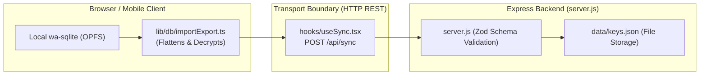

# 🔄 Module 10: Full-Stack Sync & Migration Patterns

> **Instructor**: "In software engineering, writing code is easy—evolving data without breaking existing users is hard! In this module, we will explore full-stack schema synchronization, dual wire formats, non-destructive legacy migrations, and solving asynchronous hydration races."

---

## 🏛️ 1. The Express Sync Gateway (`server.js`)

While KeyStash is a local-first application, users can optionally run a lightweight Node.js Express server (`server.js`) to synchronize their encrypted vaults across desktop and mobile devices.



---

## 📜 2. The Golden Rule of Schema Synchronization

When building full-stack TypeScript applications, you have two layers of validation:
1. **TypeScript Interfaces**: Checked by the compiler during `npm run build`.
2. **Zod Runtime Schemas**: Checked when data enters the client or server.

### The System Guardrail:
If you add a field to a data model (for example, `isFavorite: boolean` or `expiryDate: string`), you **MUST update four locations simultaneously**:

1. **Frontend Interface**: [frontend/src/types/index.ts](file:///Users/aadilmallick/Documents/aadildev/projects/key-stash-manager/frontend/src/types/index.ts)
2. **Frontend Zod Validator**: `secretZodSchema` in `frontend/src/types/index.ts`
3. **Frontend DB Row Schema**: `secretRowSchema` in `frontend/src/lib/db/schema.ts`
4. **Backend Zod Validator**: `secretSchema` in `server.js`

If you fail to update `server.js`, the backend will reject incoming sync payloads with HTTP 400 Bad Request!

---

## 🔄 3. Dual Data Models: Relational vs. Nested Wire Format

Key Stash Manager maintains two distinct data formats:

### Format A: Flat Relational Collections (Client Database)
Optimized for high-performance SQL queries, joins, and reactive updates in wa-sqlite:
```
profiles: { id, name, createdAt, updatedAt }
folders:  { id, profileId, name, order }
secrets:  { id, folderId, name, value (ciphertext), description, order }
```

### Format B: Nested Document Wire Format (JSON Export & Sync)
Optimized for human readability, atomic JSON file exports, and REST sync payloads:
```json
{
  "profiles": [
    {
      "id": "prof-1",
      "name": "Personal",
      "folders": [
        {
          "id": "fold-1",
          "name": "Stripe & Payments",
          "secrets": [
            {
              "id": "sec-1",
              "name": "STRIPE_SECRET_KEY",
              "value": "sk_live_12345"
            }
          ]
        }
      ]
    }
  ]
}
```

### Bidirectional Conversion in `importExport.ts`:
* **`buildNestedSecretsData(collections, vaultKey)`**: Reads flat collections from SQLite, decrypts secret values in memory, and stitches them into a nested JSON structure for export.
* **`flattenAndUpsert(collections, vaultKey, nestedData)`**: Parses the nested JSON wire format, encrypts each secret with the device vault key, and batch-upserts rows into SQLite collections.

---

## 🛡️ 4. Non-Destructive Migrations (`migrateLegacyV1`)

What happens when an existing user updates the app from an older version? **Never destroy user data.**

In [frontend/src/lib/db/migrations.ts](file:///Users/aadilmallick/Documents/aadildev/projects/key-stash-manager/frontend/src/lib/db/migrations.ts), we maintain automatic fallback migrations:

```typescript
export function migrateLegacyV1(raw: any): SecretsData {
  // Legacy V1 had no profiles! It was just a top-level { folders: [...] }
  if (Array.isArray(raw.folders) && !raw.profiles) {
    return {
      profiles: [
        {
          id: "default-profile",
          name: "Default Profile",
          folders: raw.folders,
          createdAt: new Date().toISOString(),
          updatedAt: new Date().toISOString(),
        },
      ],
    };
  }
  return raw;
}
```

### First-Run Seeding Priority Order:
When `seedCollectionsIfNeeded()` boots, it checks data sources in a strict priority order:
1. **Real User Data**: `localStorage["api-key-manager-secrets"]` (migrated from legacy version and preserved as backup).
2. **Dev Fixture**: `mockdata/initdata.json` (only loaded in `import.meta.env.DEV`).
3. **Cold Start**: Generates a clean, empty default profile in production.

---

## ⚡ 5. Concurrency & Hydration Race Conditions

Two subtle asynchronous bugs can corrupt database initialization:

### Race Bug 1: React StrictMode Double-Invoke
In development mode, React 18 invokes effects twice. Without memoization, two concurrent seed routines run simultaneously, collide on unique primary keys, and throw `DuplicateKeyError`.
* **Fix**: Wrap seeding behind a single in-flight promise (`seedPromise`).

### Race Bug 2: Unhydrated OPFS Collections
When a user switches browser tabs, the browser may background the tab to save memory. Upon returning, the tab restores.

If the app checks `collections.config.get("seedComplete")` **before** the SQLite persistence layer has finished hydrating from OPFS, the check reads `undefined` ("unseeded"), and mistakenly overwrites the user's real secrets with default mock data!

* **Fix**: Always `await collections.config.preload()` before reading config markers:
```typescript
// frontend/src/lib/db/migrations.ts
await collections.config.preload(); // Wait for OPFS worker hydration!
const isSeeded = await collections.config.get("seedComplete");
if (isSeeded) return; // Safely skip re-seeding!
```

---

## 🏋️ Bootcamp Lab Exercise 10

### Objective:
Inspect migration and schema serialization tests.

1. Open `frontend/src/lib/db/migrations.test.ts`.
2. Run the test:
   ```bash
   cd frontend && npx vitest run src/lib/db/migrations.test.ts
   ```
3. Look at how the test asserts that legacy un-profiled data is properly wrapped inside a newly generated "Default Profile" without losing any child folders or secrets!
4. Challenge: If you wanted to add an optional `color: string` property to `Folder`, write out the exact edits you would need to make across `schema.ts`, `types/index.ts`, and `server.js`.

---

Time to master testing and production deployment! Proceed to [Module 11: Testing & Production Hardening](./11-testing-and-production-hardening.md).
